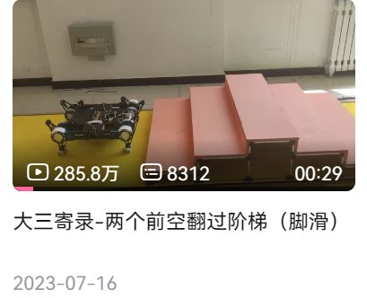

在这个简陋的文档开头先简单做一下自我介绍。我是福建理工大学MTI足式组的负责人Lain，在2025赛季基本完整负责了马术一队的研发，并参与了二、三队的研发。最后的成绩为江阴赛区竞速赛30名，障碍赛31名，越野赛34名，共三项国二，算是实现了队伍马术的第一次全赛道国二。

高三暑假被太原工业的马术视频拉入RC：[大三寄录-两个前空翻过阶梯（脚滑）*哔哩哔哩*bilibili](https://www.bilibili.com/video/BV1sz4y147t6/?spm_id_from=333.1387.upload.video_card.click\&vd_source=193a56b6f00b33090010ba20d05cfef7)

是的就是这个万恶之源

大一主要负责ROBOCON主题赛，大二作为电控组负责人不满队内马术现状，于是梭哈马术。

24年7月项目启动，至25年7月参赛，历时一年。我从机械、材料选型、配合、电机选型、电机驱动、算法优化和MID360导航方案验证，算是全栈做完了一只四足机器人。在此分享一些自己对**RC足式机器人赛道**乃至足式机器人较泛的理解，属于**扫盲**性质。

文档的前半部分为理论推导，涉及以下内容：运动学、雅可比、静力学、动力学。理论部分看不懂不影响后文，不想深究可以跳过。后半部分为工程基础部分与制作经验，涉及：机械结构类型、控制算法介绍以及部分简单实现、感知与导航算法、我在实际制作过程中总结的部分工程经验。制作前可以看看，没啥理解门槛。

