以下为偏工程应用的部分。

## （一） 四足机械结构设计

目前比赛中的主流结构涉及多种连杆与驱动形式，我们分为并联与串联构型讨论。

### 1 并联构型：

关于并联结构的解析可见狗王的视频：

[并联四足机器人的机遇与挑战分享(上)*哔哩哔哩*bilibili](https://www.bilibili.com/video/BV1Dq4y1u78t/)

[并联四足机器人的机遇与挑战(中)*哔哩哔哩*bilibili](https://www.bilibili.com/video/BV13S4y1X7Dg/?vd_source=425167508f9e3d1f23c644a6948470f1)

[并联四足机器人的机遇与挑战(下)*哔哩哔哩*bilibili](https://www.bilibili.com/video/BV1uL4y1W7Ya/?vd_source=425167508f9e3d1f23c644a6948470f1)

#### 1.1 五连杆

比较古老，主要出现在21、22赛季。电机集中安装在连杆的同一侧，在RC赛场中基本为直驱，即一般不同轴。
优势：减少传动部件，降低整体体积和重量，结构最为简单。
劣势：同侧驱动可能导致连杆受力不均，长期使用易引发结构疲劳。单侧驱动在需要大角度摆动的场景中限制了连杆的运动范围，无法实现完全对称性的步态运动，导致最终展示出的运动性能往往不佳。

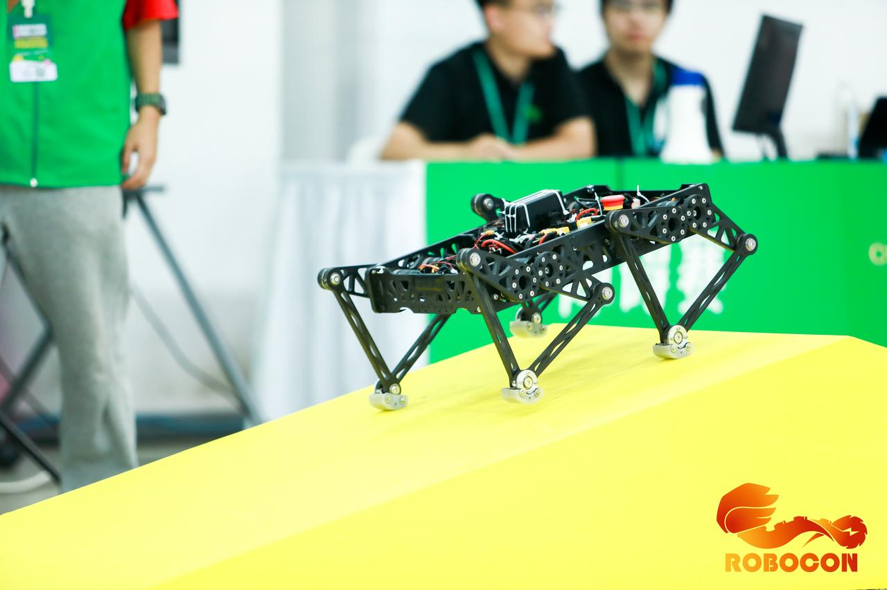

#### 1.2 同轴五连杆（即俗称的四连杆）：

目前RC足式赛场的版本答案与主流产物。
优势：对比非同轴四连杆可实现更对称的运动轨迹。当然，通过皮带、齿轮传动是等效的，例如经典的Doggo。

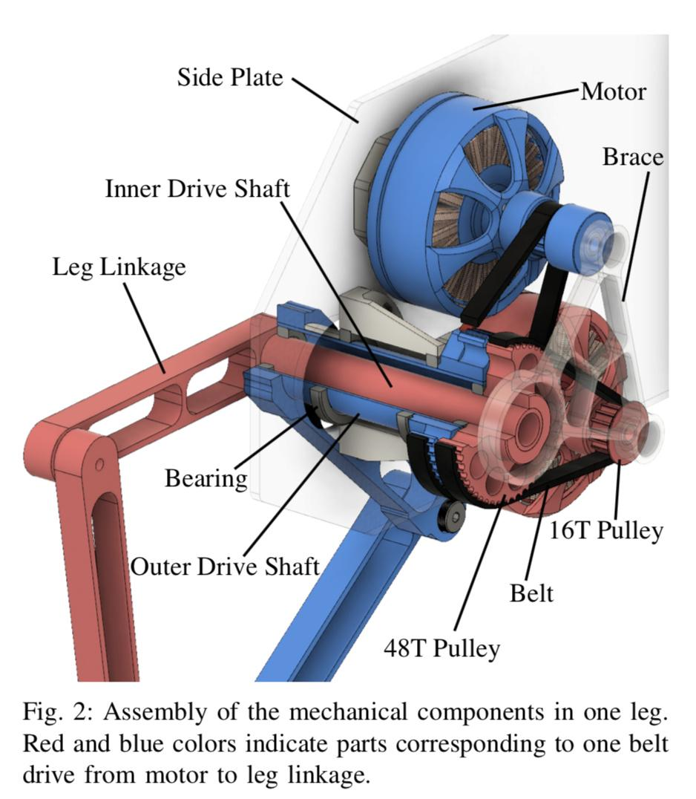

结构简单，加工复杂度和成本比较低，高速运动稳定性高，受力更优，对电机力矩要求低，控制简单方便，上手快速。在过去的5年中一直是最有性价比的选择，解决了非同轴五连杆的设计缺陷。
劣势：基本无。但对比串联机构步长会相对较小。

延长五连杆、延长同轴五连杆出现较少，整体解算、运动学基本相同，此处不多赘述。

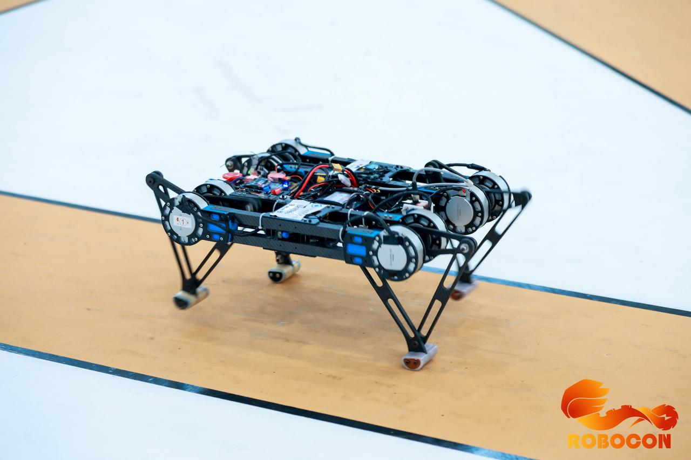

### 2 串联构型：

#### 2.1 关节直驱（ETH的Anymal构型为例）&#x20;

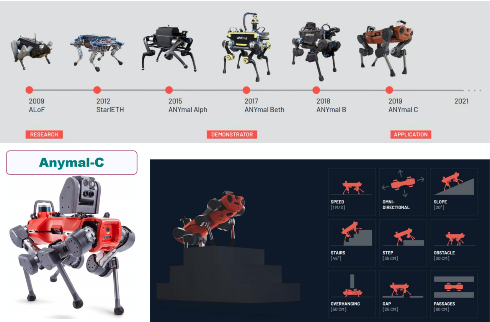

优势：采用关节直驱、异形连杆设计（此为Anymal特殊，非异形连杆可以参考山猫、璇玑等公司的直驱轮足），结构简单、易于维修。

劣势：由于今年的马术3队选择了此构型，所以其实也清楚这种构型会有多少弊端了。

（1）首先是关节直驱构型统一的缺点：腿部惯量大。这会导致VMC、MPC等依赖轻量化腿假设的经典模型失效，并且对腿部电机的扭矩与响应精度提出了更高的要求。

（2）摆动力需求增大时，柔顺性控制的难度也随之增加，因为需要同时考虑腿部的惯性、关节摩擦及足底受力情况。此时，足底力的估计不能忽略腿部的惯量效应，否则会导致力控误差和控制性能下降。

（3）而对于Anymal的特殊连杆构型来说，传统四足机器人多采用直线连杆结构，而Anymal为异形连杆，小腿和足底形成曲线连接，传统的刚体动力学假设难以直接应用，需要考虑连杆的几何非线性和复杂的运动学关系。

国内北京理工大学博士华北舵狗王设计了此机器人Tinymal-B桌面版与Tinymal-C1的微缩版，但设计上的问题不少，仅参考。[Home | Tinymal的机器人世界](https://tinymal.cn/)今年枣庄学院也上场了这只小狗，狗王的力控制算法还是有点东西的，小狗狗越野爬坡很轻松。

#### 2.2 关节非直驱

提及非直驱串联四足，我们不得不提及MIT Cheetah Mini。这几乎是早期所有国产机械狗的鼻祖，2019年开源之后带来了国产机械狗（例如蔚蓝阿尔法、小米铁蛋等等）的井喷，同样深刻影响了RC马术机器人的串联非直驱构型设计。此方案的核心思想为:将膝关节电机上移减少腿部转动惯量，再使用同步带/连杆的方式进行传动。

##### 2.2.1 同步带

同步带传动是通过带齿与轮齿的啮合传递动力，通过主动轮与从动轮的分度圆直径差形成传动比，牺牲电机转速换取力矩放大。其传动效率高，响应时间短，制作成本低，电机自由度高，但需要在结构设计上配合张紧机构，且同步带长期使用很容易松弛。

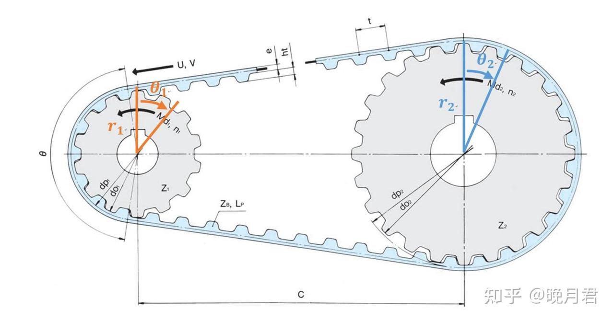

本赛季中，北方工业大学和我们的马术3队都使用了同步带方案。

##### 2.2.2 平行四边形连杆

是目前的主要设计构型，喜闻乐见。今年大多数串联狗均为此设计。平行四边形连杆是通过两组等长且平行（或反平行）的刚性杆件形成闭环结构，将电机的旋转运动转化为关节的定向转动。主流采用平行四边形布局，通过 4 个高精度铰接点构成刚性传动链，将小腿传动机构内置于大腿腔体，实现膝关节转动时足端轨迹的线性平移。基于 DH 参数法建模时，连杆长度 a₁与 a₂相等、扭转角 α₁=α₂=0，可以简化运动学方程。

反平行四连杆的空间利用效率更高，但设计上多少沾点拧巴，所以还是算了。另外，作为电控如果看到机械画了非平行四连杆机构给你调请务必暴打他。

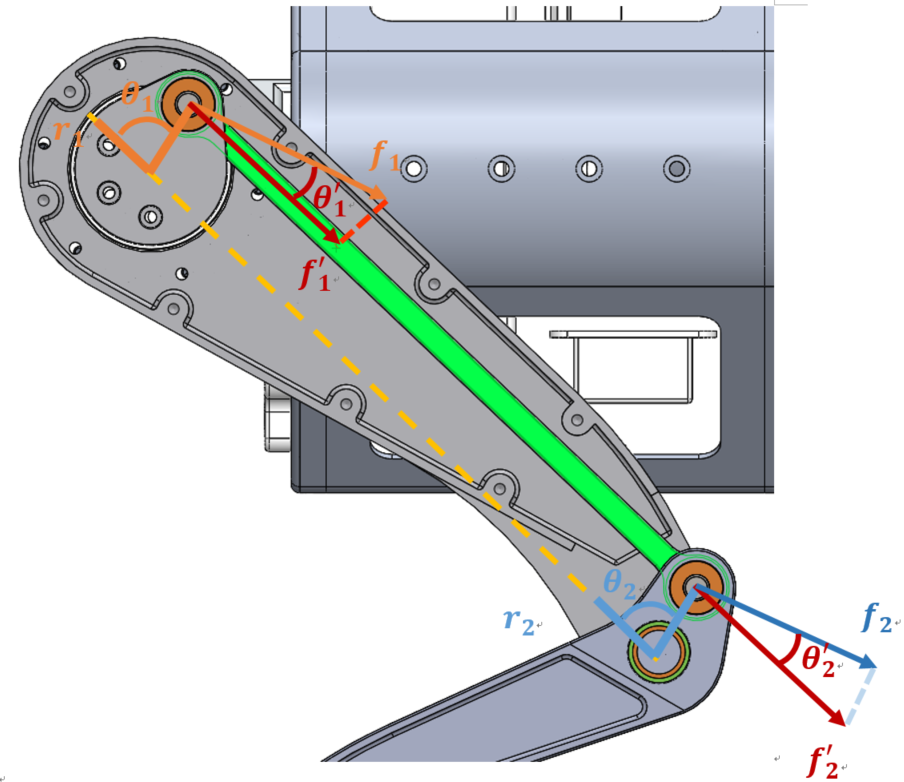

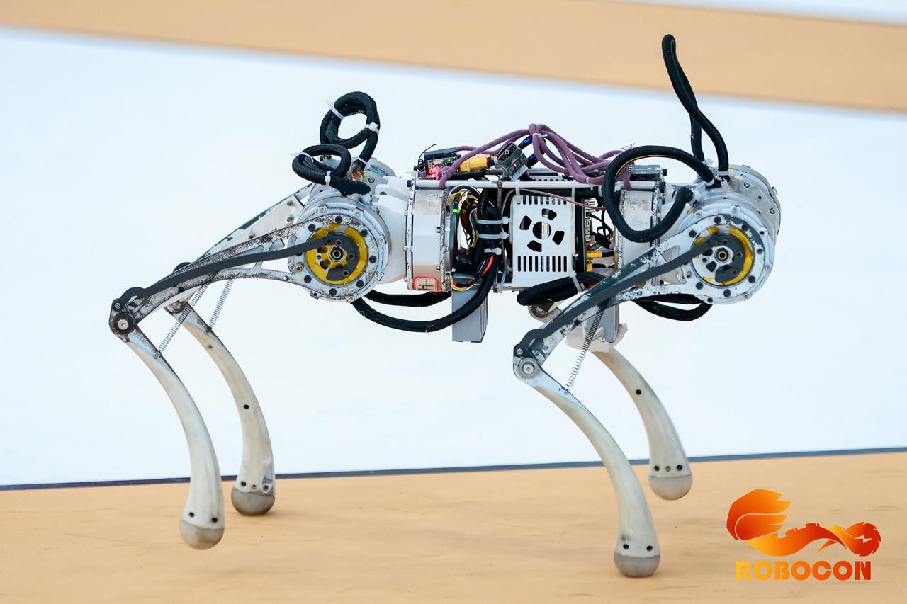

##### 2.2.3 减速齿轮+平行四边形连杆组合

目前也开始在RC中出现了，比如北科。本质就是**用齿轮的力矩增益弥补连杆的原生扭矩短板**，契合电机T-N曲线：将电机工作点从高扭矩低效率区间，转移至中扭矩高效率区间。这是我目前**最推荐**的腿部传动方案。

首先我们可以明确的是所有的电机都是有对应的T-N曲线，也就是说在各个扭矩大小的情况下，对应的转速是不相同的，这也导致在高速度、高响应情况下如果想提高电机的可用性就需要尽可能减少电机在当前荷载的扭矩需求。在同等步态速度下，增加减速齿可以使得电机工作点落在高效区间，对电机更加友好。

此设计一般将行星齿轮减速器嵌入大腿近端电机腔体，输出端直接驱动平行四边形连杆主动臂，轴向尺寸较少，未破坏腿部轻量化优势。在成本略微增加的情况下显著减少了膝关节电机的压力。

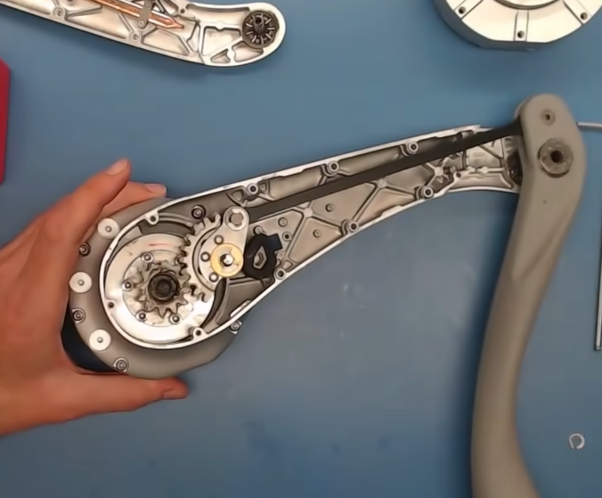

截图来自视频：[宇树 Go2 拆机系列连载（十）狗腿拆解 | 机器狗 行业标杆 结构揭秘#机器狗拆机*哔哩哔哩*bilibili](https://www.bilibili.com/video/BV1zp8Je9EpR/?spm_id_from=333.337.search-card.all.click\&vd_source=193a56b6f00b33090010ba20d05cfef7)

宇树B1也是一样的结构。

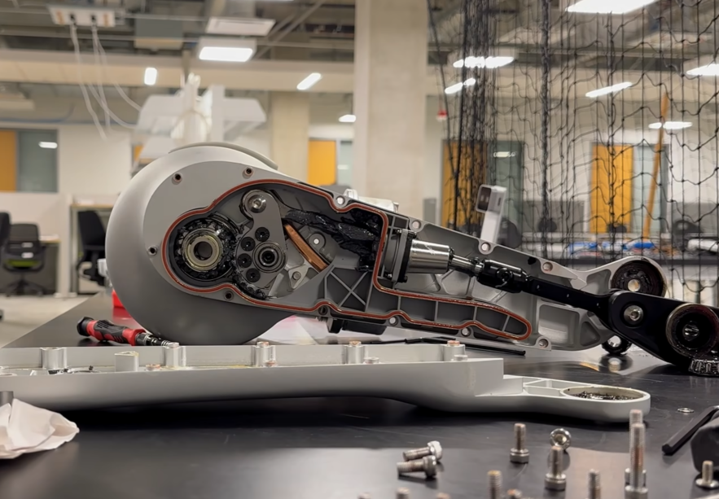

截图来自视频：[【留学日记#252】宇树UnitreeB1机器人左前腿拆卸（2024.7.28）*哔哩哔哩*bilibili](https://www.bilibili.com/video/BV1KD1NY5ENE/?spm_id_from=333.337.search-card.all.click\&vd_source=193a56b6f00b33090010ba20d05cfef7)

演示视频可见：[宇树Go2机器狗腿部关节运动动画#机器狗拆机*哔哩哔哩*bilibili](https://www.bilibili.com/video/BV1LhvTebEgd?vd_source=193a56b6f00b33090010ba20d05cfef7\&spm_id_from=333.788.videopod.sections)

##### 2.2.4 滚珠丝杆电机

目前仅东北大学使用。其核心是通过丝杠与螺母的啮合传动，将电机的旋转运动转化为直线运动，再通过机械结构间接驱动关节转动。从结构设计角度推测，东北大学的方案大概率采用行星滚柱丝杠构型——滚柱围绕丝杠呈行星式分布，通过线接触传递载荷。将电机集成于大腿近端，通过丝杠驱动小腿实现屈伸，这种布局虽能延续非直驱电机上移减惯量的核心优势，但丝杠本体需沿小腿轴线布置，不可避免地增加了腿部结构的轴向尺寸与复杂度。

驱动思路上，丝杆电机需解决两大核心问题：一是运动学转换，需通过算法将关节的旋转角度需求转化为丝杠的直线位移量，且需补偿传动间隙带来的误差；二是力矩匹配，根据丝杠的导程比换算电机输出扭矩，确保关节驱动力满足步态需求。

可以明确的是，这种机构并不太合适RC的足式机器人赛事。丝杆电机驱动虽静态站立时丝杠可实现低功耗锁死，但 RC 赛事以动态步态为主，丝杠的摩擦损耗显著高于平行四连杆，动态响应也受限，若出现螺纹啮合损伤等情况维护成本极高。但我很欣赏甚至可以说敬佩东大这种特立独行的技术路线。

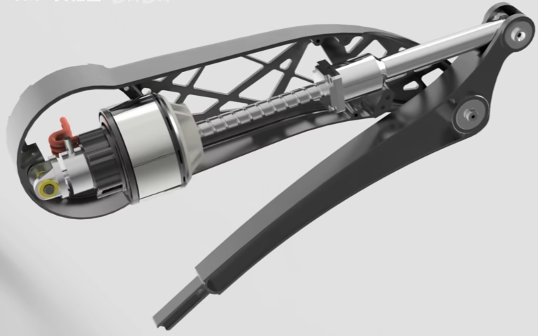

截图来自视频：[2023东北大学四足机器人Actiger机构分享*哔哩哔哩*bilibili](https://www.bilibili.com/video/BV17h4y1f7KH/?spm_id_from=333.337.search-card.all.click\&vd_source=193a56b6f00b33090010ba20d05cfef7)

[DIY Actuator for quadruped robot based on a ballscrew: Powerful! - YouTube](https://www.youtube.com/watch?v=YrpHYPPWpIk)此机构详解。

*注：比赛中出现的12自由度基本为额外添加4个髋关节，此处不再赘述。*

这里也提及腿部机械结构的另外一个分析角度：全膝式、全肘式、外膝肘式和内膝肘式。

外膝肘式和内膝肘式配置的支撑面比较大，机器人的稳定性比较好；全膝式和全肘式配置由于具有统一的关节形式，控制相对简单。目前RC赛场的串联四足主流为全膝式。全肘式有西南交大（后退完全当前进使了）[【2025 ROBOCON】西安交大四足机器人越野赛初调*哔哩哔哩*bilibili](https://www.bilibili.com/video/BV1dzG3zBEwv/?spm_id_from=333.1387.homepage.video_card.click\&vd_source=193a56b6f00b33090010ba20d05cfef7)，外膝肘式[domino宝莉第一次成功自动走下RC马术竞速全场*哔哩哔哩*bilibili](https://www.bilibili.com/video/BV1AX4y1v7r7/?spm_id_from=333.1387.favlist.content.click\&vd_source=193a56b6f00b33090010ba20d05cfef7)。

### 3 个人踩坑

#### 3.1 关于轴承的使用

在25赛季的并联足式机器人设计中，我们采用了多种轴承来提高关节的性能和稳定性。具体来说，深沟球轴承被放置在小腿与大腿交界处的内侧，而推力滚子轴承则放置在大腿与小腿交界的平面处。这种设计旨在最大程度地减少连接处的摩擦，并增强其稳定性。

此外关于输出轴，特别是当电机存在销孔或减重孔时，请务必使用尼龙打印或直接使用CNC制作嵌入减重孔的转接块或者使用销钉，而不是直接用螺丝受力。因为螺丝在抗剪方面的性能较弱，无法承担关节电机输出轴固定的重任，这东西断在关节电机里基本就取不出来了。

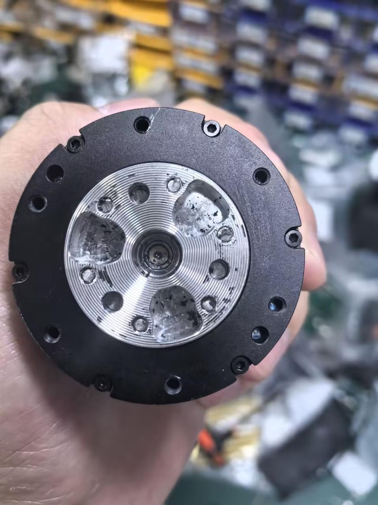

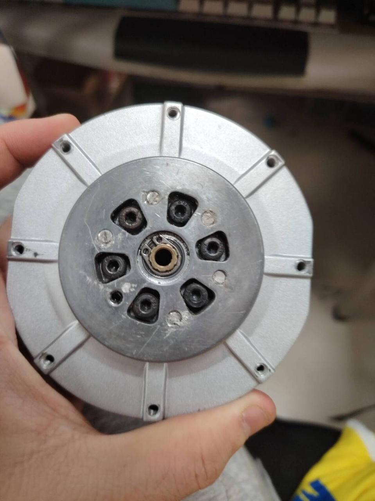

我们也与其他队伍探讨了关节连接的方案。经过综合比较塞打螺钉被认为是一个相对合适的选择，能够在保证连接牢固的同时，便于拆卸和维护。

#### 3.2 安装与运动取舍

在进行大腿结构设计时，单侧和双侧的选择直接影响机器人的运动能力。如果采用单侧板件连接，可以实现更大的运动范围，例如南方科技大学的设计，其机器人在负重5kg的情况下能够原地跳跃30厘米，这种灵活性显著增强了机器人的表现。双侧板夹的设计虽然增强了结构的稳定性，但在夹持小腿机构时可能会限制小腿的活动范围。这种设计虽然在快速标定方面有其优势，却可能导致机器人步高被限制在50mm以内，从而在越野赛中表现不佳，无法有效应对草坡和其他障碍，只能采用小跳跃的方式通过。

#### 3.3 使用圆形碳管的设计问题

圆形碳管我不建议将其作为四足机器人的主要结构件。因为碳管通常会完全依赖于金属三通管夹和金属圆形方形管夹，这种设计会显著增加成本，毕竟一个金属三通管夹就要接近20R。为了节省成本，虽然可以考虑使用打印件管夹来固定碳管，但即便是尼龙碳管的整体结构也会显得相当不稳定。在我们的调试过程中，四足机器人甚至扭曲成了一个奇怪的平行四边形。尽管使用了铜柱进行加强固定，问题依然存在，管夹作为固定机构即使设计了贯穿孔进行定位，也难以保证稳定性。最终我们选择用两块5毫米的玻纤板对两侧的四根碳管进行死限位，从而解决了稳定性的问题。

当然也有一些相对较好的固定方式。例如，宁波工程的设计通过纵向板、侧向管的结构，再使用打印件+热熔螺母实现了管与板的固定，效果非常不错。

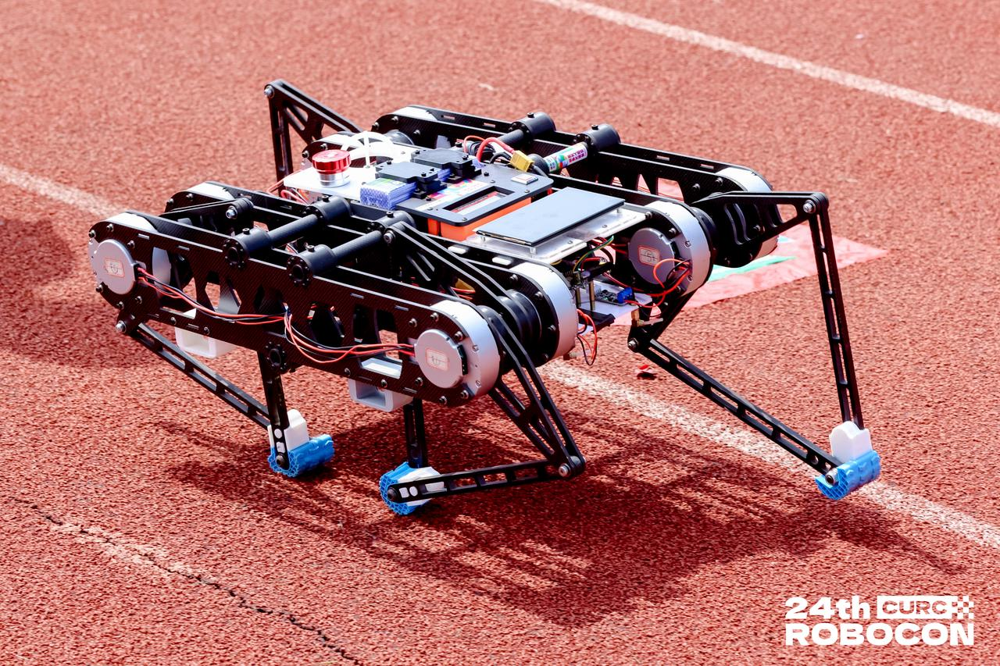

另外，还有更为激进的方案，比如使用单根大圆形探管，类似于今年的太原工业设计。基于这种思路，我们也设计了一种极其激进的结构，基本上就是一个电机架子，整体结构件的重量控制在4.9千克。

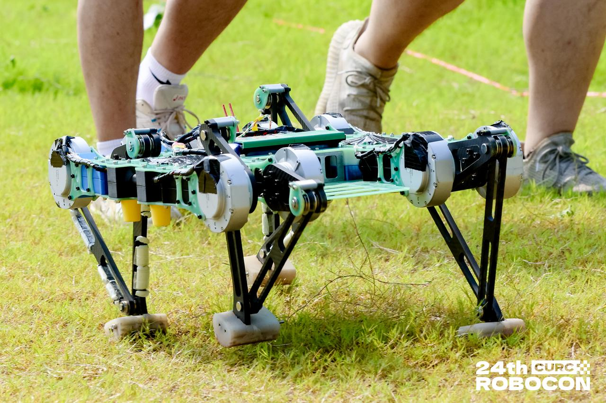

#### 3.4 力矩需求问题

关于电机的力矩需求，我在前文中已经讨论了如何通过简单的力矩和力臂计算进行电机选型。在大多数情况下，使用trot步态进行计算是合适的，此时双足作为支撑态，并预留足够的冗余。显而易见，采用并联腿设计所需的力矩明显小于串联腿设计。因此，如果电机的性能无法满足使用要求，我建议采用并联腿设计，这对电控和机械结构都是有利的。

今年我们的串联腿使用了宇树关节电机，并结合同步带进行传动设计。这一方案可以完全移植到并联机器人的框架中，仅需调整计算方式。然而，我们遇到的问题在于由于力臂过长小腿关节电机的扭矩无法满足相应的使用要求，导致机器人只能勉强站立，一旦开始行走，后腿便会因电机扭矩不足而弯曲倒地，无法维持支撑。在进行电机选型之前，必须先设计整体结构，明确尺寸比例和具体长度，然后再确定电机的规格，并通过电机的TN曲线来选择合适的减速比。我们需要找到电机工作时的最高效率点或效率区间，通常在65%到75%之间。在这个效率区间内，寻找对应的电机扭矩，然后通过减速比将电机的扭矩放大，以满足我们通过力矩和力臂模型计算出的所需扭矩，并乘以冗余比例。这是我认为一种相对科学的关节电机选型和传动减速设计的思路。

#### 3.5 限位的重要性

可以明确的是，无论是采用同步带机构还是平四边形连杆机构，在小腿伸缩到极限位置时，都必须设置机械限位装置。否则这些传动机构在超过极限位置时，容易发生解算多解导致关节卡死的问题。解决方案是在机器人外壳内部上——基本在大腿靠近膝关节处——增加一块凸起的限位板。如果采用减速器配合平四边形连杆机构，还应在减速器处设置凸起挡块。该挡块可以采用橡胶材料，也可以使用TPU，内部嵌入铜柱或者直接上铆钉（毕竟螺丝抗剪力弱），以提供一定的缓冲效果。

在小腿伸展过程中，凸轮盘带动连杆运动，当电杆顶端碰撞到凸起挡块时，挡块应发挥限制运动的作用，避免小腿伸展超过设计的死区范围。收回到极限位置时，小腿与大腿的弧线部分会重叠挤压，需注意避免极限位置的结构挤压导致损伤。

#### 3.6 镂空问题与结构干涉

关于狗子的减重设计实际空间并不多。因为基斯的文档（[(12 封私信 / 8 条消息) 轻量化设计指南 - 知乎](https://zhuanlan.zhihu.com/p/466181447)）中已明确提到减重设计有两个主要方面：第一种是结构性的镂空，第二种是在结构设计无法避免的情况下进行的镂空。由于狗子的机械结构设计比较简单，目前已经基本趋于最优解，因此在大范围的结构性减重方面较为困难，更多的只能进行镂空。当然也有北科这种全CNC能硬控到13kg的怪物。

另外，在SW计算和实际装配中，我们没有发现与螺丝干涉的问题。然而，在比赛中我们遇到了一些意外情况。一台宇树电机的输出轴出现了歪斜，导致在某些特殊受力角度下，并联狗的碳管小腿与管夹的固定螺丝发生了干涉。这一问题迫使我们降低了机器狗的爆发速度，最终在比赛中仅能以22秒的成绩完成。鬼知道为什么输出轴这东西能歪斜。所有可能出现干涉的地方都需要尽可能做好距离隔离，血的教训。

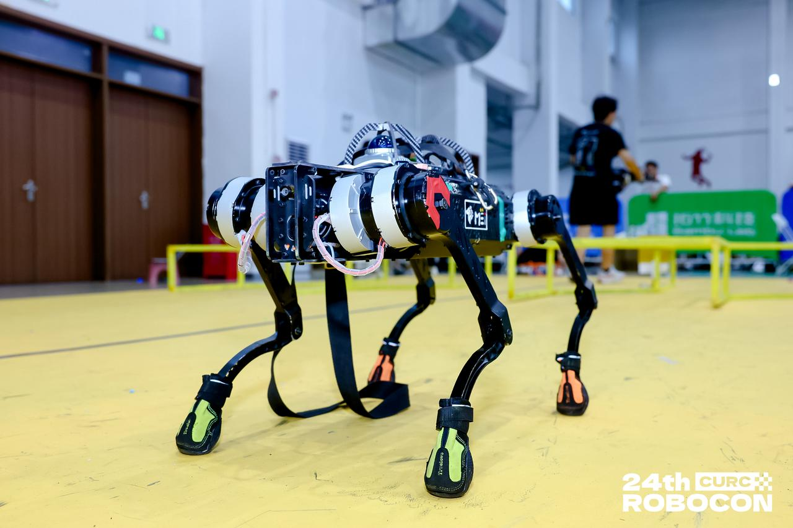

#### 3.7 足端设计

足端为了减少运动噪声并实现机械缓冲，可以采用中空框架结构，主体骨架材料可选用塑料或金属。这样既能保证主体结构具备刚性平台，又能设计较大面积的弧面，使机器人足底与地面接触时形成较大的接触面，提升站立稳定性，避免点接触引发的压力集中。

第一层缓冲可以使用橡胶、硅胶、TPU等弹性材料，实现足底的缓冲效果，且通过调整橡胶容器的尺寸和高度，可获得不同的性能。

另外，硅胶仅在干燥贴合地面表现好，例如赛场场地。若场景含湿滑地或粗糙地，需换橡胶皮或成品足端。TPU的抗冲击性远不如成品足端的结构化设计，落地时易出现足端开裂的情况，且不方便添加气压传感器。宇树的成品足端除了贵没有什么缺点，铁蛋足端除了买不到也没什么缺点（

## （二） 控制算法

### 1 位置控制

时至今日，位置控制依然是RC赛场的主流。其控制简单、上手速度快、效果好，例如25赛季的竞速赛冠军为哈工程的位置控制，在完全直线的情况下其速度比北科的MPC与大交的RL还好，就很……见鬼。当然，这也是新队伍最推荐的方案。
对于位置控制，我们可以简单地拆分为关节逆解算与足端轨迹两部分。这两部分一组合加上电机角度环驱动就可以完成运动系统构建，难度最低。
经典串联腿逆解（腿侧平面）

经典并联腿逆解（腿侧平面）

简单的足端轨迹处理（均为侧平面）

1. `摆线轨迹`

位置和速度连续，冲击小，足端落地时垂直速度为0

* `类正弦轨迹`

计算简单，平滑性好，工程中常用

* `三次多项式轨迹`

可精确控制起点和终点的速度，平滑性好

* `三次贝塞尔曲线轨迹`

`通过控制点灵活调整曲线形状，平滑性好，适合复杂轨迹规划`

* P0: 起点 (start\_x, start\_y, start\_z)

* P1: 起点前向控制点 (start\_x + step\_length/3, start\_y, start\_z + step\_height/2)

* P2: 终点后向控制点 (start\_x + 2\*step\_length/3, start\_y, start\_z + step\_height/2)

* P3: 终点 (start\_x + step\_length, start\_y, start\_z)

八自由度并联/串联四足用以上的知识点差不多够了，对理论要求很低，最低限度下只需要调整步长、步频、起始点、电机PD参数，但效果相当不错。

### 2 力控制（VMC）：

[(12 封私信 / 6 条消息) 为什么我们在机器人运动控制中一直在强调力控？（Force/Torque Control） - 知乎](https://zhuanlan.zhihu.com/p/31811242)

位控的机器人是没有灵魂的，因为位控的电机实际和舵机没什么区别。关于RC机器人力控可以参考这两份开源：

宁波工程Leader开源项目：<https://github.com/Leader-txt/VMC_Quadruped_Controller>

哈工程可可开源项目<https://github.com/Prcheems/Corgi_for_ROBOCON.git>

以及经典文章[(46 封私信 / 19 条消息) 五连杆运动学解算与VMC - 知乎](https://zhuanlan.zhihu.com/p/613007726)

主要参考论文:四足机器人对角小跑步态虚拟模型直觉控制方法研究\_谢惠祥

虚拟模型控制算法，也就是VMC算法，是一种**直觉控制方法**，其核心思想是利用虚拟的机械部件（如弹簧、阻尼器、轴承，或者其他任何可以想象的组件）连接机器人内部作用点或者连接作用点与外部环境，产生虚拟力来驱动机器人实现运动，但是虚拟力不是实际执行机构的作用力或力矩，故需要通过雅可比矩阵将虚拟力转换到具体的执行机构上，从而计算出期望的关节力矩作为关节控制的输入，只不过真实关节的扭矩所产生力的效果与虚拟力产生的效果相同，均可驱使机器人按照期望运动。VMC的优势在于它简化了复杂动态系统的控制：用户可以直观地设计虚拟力，而不需要深入处理底层动态方程，从而使得传统方法难以描述的复杂任务可以用简单的虚拟模型轻松描述。

例如希望机器人在一个未知的平面上施加冲击，这实际上是一个很难使用数学描述的任务，但是如果使用VMC算法，只需要将虚拟的弹簧、阻尼器和一个有给定动能的虚拟质量附着在机器人手上，机器人的手在虚拟组件集合的作用下移动，对未知平面产生预期冲击之后，虚拟质量在虚拟弹簧阻尼器的作用下反弹了回来。

再以足式机器人的二自由度单腿结构为例，其结构可简化为下图的形式，A、B两个转动副可以由电机驱动，对应的角度可以通过电机编码器测量出，两个连杆的长度 $$L_1$$ 和 $$L_2$$ 可以通过机械参数直接获取，控制任务主要是关注机构末端或者说足端 C 点的位置，位置可以使用直角坐标或者极坐标表示。

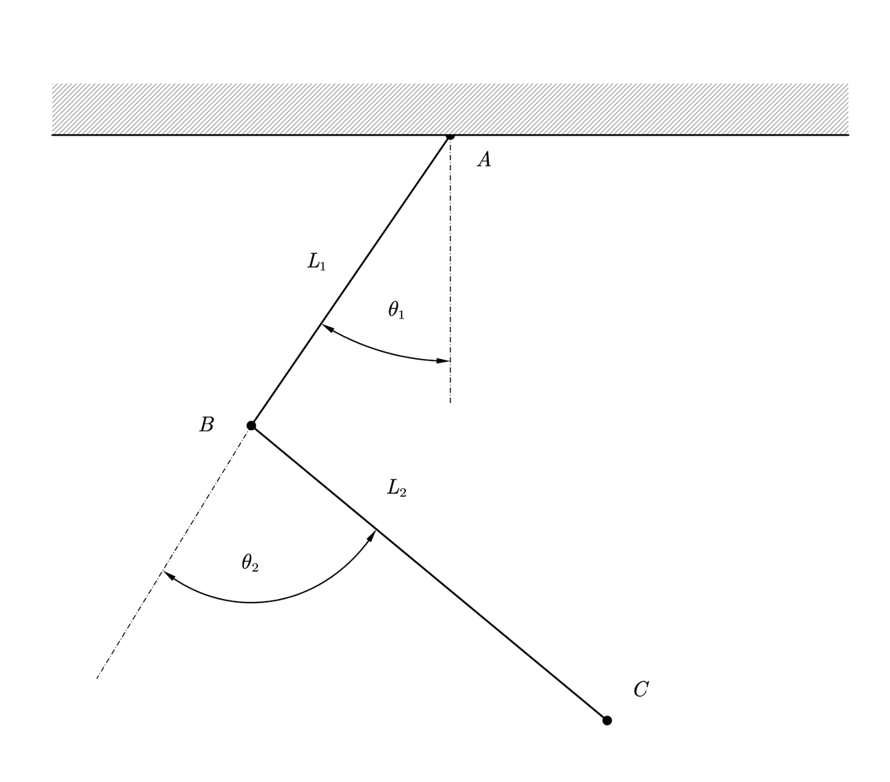

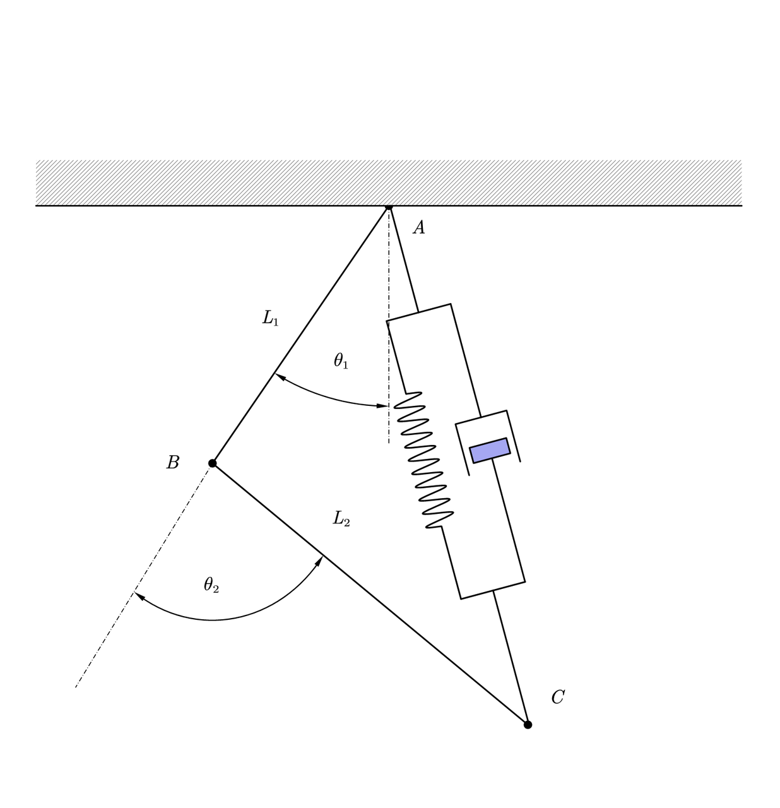

VMC 方法是直觉控制方法中的典型代表，其特点是不需要进行机器人的逆运动学求解，综合考虑了机器人的机身高度、姿态和前进速度等，较为简单易控，极大提高了计算效率，控制效率较高。

VMC 的应用关键在于两点：一是在每个需要控制的自由度上构造恰当的虚拟构件以产生合适的虚拟力；二是在不同的相位状态利用相应的雅可比矩阵计算期望的关节力矩。

虚拟力并不是实际存在的作用力，而是假想的力，机器人的实际运动是靠各个关节的扭矩实现的，为了建立虚拟力与关节扭矩之间的关系，需要先将工作空间中的力或者力矩映射到关节空间下的关节力矩，这一步可以先通过正运动学模型获取空间映射关系，也就是将关节空间向量映射到工作空间向量上去

$$\mathbf x=f(\mathbf q),其中\mathbf x=[x_1,\cdots,x_m],\mathbf q=[q_1,\cdots,q_n]$$

其中的 x 是机器人坐标系相对于地面坐标系的 m 个自由度对应的位姿向量，这组向量必须完全描述系统的构型，在常用直角坐标系下可描述为坐标向量，q 为 n 个关节变量的位置向量，对于转动关节其对应关节的转动角度，对于移动关节其对应关节的位移

如果对其进行求导，就是雅可比矩阵，也就是一阶微分运动学和静力学部分的理论。注意一下，雅可比矩阵并不是一个固定不变的矩阵，其会随着关节角度的变化而变化。VMC力控：给定目标位置，通过针对某一物理量的PD控制输出虚拟力，再通过Jacobi矩阵映射到关节电机力矩输出，从而达到目标位置。所以首先要进行正运动解。

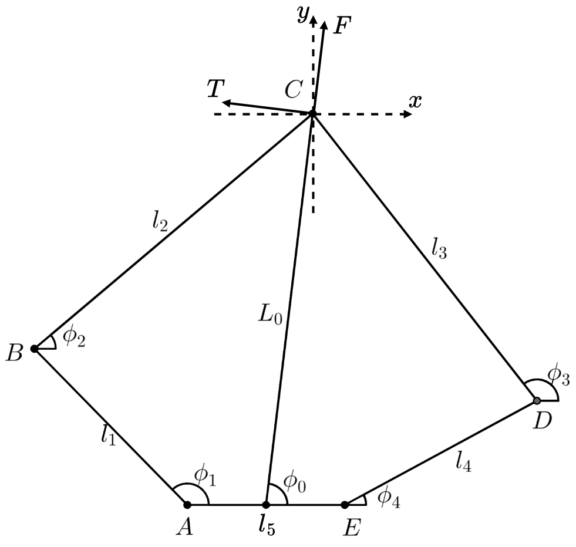

### 3 MPC：

这是北科24、25赛季的方案。我们可以分为三个主流框架，经典MIT Cheetah Software、leggedcontrol框架以及Quad-SDK。会分开简单介绍。

#### 3.1 MIT Cheetah Software

四足机器人学习中不得不品的一环。以下为MIT Cheetah Mini的开源资料

运行代码[https://http://github.com/mit-biomimetics/Cheetah-Software](https://link.zhihu.com/?target=https%3A//github.com/mit-biomimetics/Cheetah-Software)

电机控制器硬件[bgkatz/3phase\_integrated: 3-phase motor controller with integrated position sensor](https://github.com/bgkatz/3phase_integrated)

电机控制器固件[Hobbyking\_Cheetah\_Compact\_DRV8323 - DRV8323RS Version | Mbed](https://os.mbed.com/users/benkatz/code/Hobbyking_Cheetah_Compact_DRV8323/)

SPINE硬件[bgkatz/SPIne: UP board / rasperry pi to quad CAN Bus](https://github.com/bgkatz/SPIne)

SPINE固件[SPIne - SPI to quad CAN firmware | Mbed](https://os.mbed.com/users/benkatz/code/SPIne/)

MIT Cheetah Mini设计框图如下（来自知乎陈不陈）

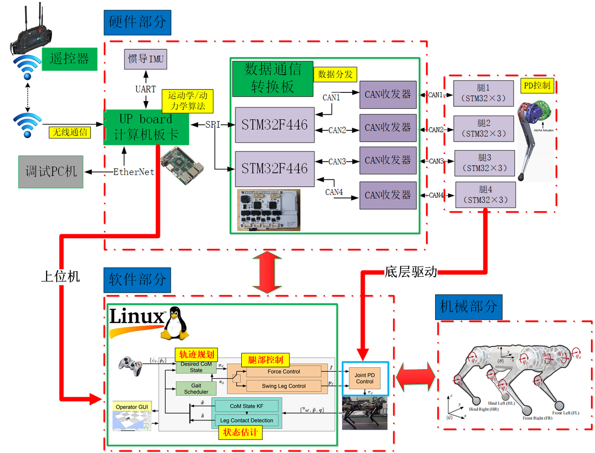

**MPC输入量：**

1.机械狗身体期望轨迹：质心位置、速度、角速度。

2.物理模型参数：转动惯量、旋转矩阵、足底位置矢量等。

3.步态规划信息：足端摆动/支撑状态判断。

4.当前状态观测值：通过IMU、关节编码器和状态估计器获取的机器人位姿、速度等实时数据。

**MPC输出量：**

1.足端反作用力：四足触地力的最优解序列。

2.状态参考轨迹：预测的质心位置、速度、角速度轨迹。

**WBC输入量：**

1.MPC的输出：足端反作用力及质心参考轨迹。

2.任务优先级指令：基座姿态、足端位置、关节力矩限制。

3.动力学参数：浮动基动力学模型，含质量矩阵、科氏力、重力项等。

4.实时传感器数据：关节位置/速度、IMU 数据、接触状态。

**WBC输出量：**

1.关节控制指令：关节力矩命令与关节位置/速度命令。

2.优化后的接触力：在满足摩擦锥约束下调整的足端力。

更详细实现可参考陈不陈的系列文章： &#x20;

* [MPC 控制器设计](https://zhuanlan.zhihu.com/p/640057159) &#x20;

* [WBC 原理与代码分析](https://zhuanlan.zhihu.com/p/641297823)。

#### 3.2 legged\_control

这是目前最合适的轻量级MPC控制框架，没有之一。廖佬还是有点太超模了。

1.性能更优

框架基于OCS2 Toolbox与ros-control构建OCS2作为 ETH Zurich 研发的优化控制工具箱，专为NMPC设计，通过变分线性化技术和稀疏矩阵求解器，能快速完成复杂动力学约束下的优化问题求解；ros-control简化了仿真与实机的迁移流程，无需针对硬件接口大幅改造，在计算效率、部署灵活性上均优于 MIT Cheetah-Software。

3.易用性更强，开发测试效率高

MIT Cheetah-Software框架问题其实不少。一是代码体系冗余复杂，其包含上下位机全栈代码，虽然代码习惯很好但确实看得头疼；二是作者已停止维护，后续优化不可能有官方支持（legged\_control其实也差不多停止了，但毕竟还是有仓库提交的）。legged\_control提供完整的 ROS 接口文档和示例代码，控制逻辑按状态估计、步态生成、MPC 求解、力矩分配的流程展开。仿真环境支持Gazebo，预设多种地形场景，可通过roslaunch命令直接启动仿真，无需复杂的前置配置，方便太多了。

4.轻量化

与 Quad-SDK 等全栈框架不同，legged\_control 专注于控制层的核心功能，形成了轻量高效的独特定位。这种设计使其代码量更小、学习曲线更平缓。

项目地址：<https://github.com/qiayuanl/legged_control>

使用过的部署教学：[Legged\_control 本地部署指南（小白友好版） - 技术讨论 - rcbbs](https://rcbbs.top/t/topic/1382)

#### 3.3 Quad-SDK（没部署过，请供参考。介绍来自论文与博客）

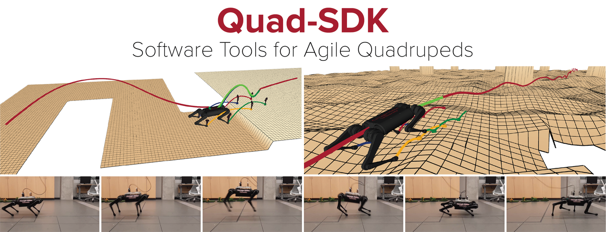

Quad-SDK是卡耐基梅隆大学Robomechanics Lab主导开发的开源框架。其核心可以概括为：非线性MPC控制器、全局轨迹规划、长周期局部步态规划。

1.非线性MPC控制器

Quad-SDK的核心优势源于其采用的RF-MPC框架，该技术源自丁博士团队2020年发表的经典论文。与MIT Mini Cheetah采用的线性化MPC不同，RF-MPC直接使用旋转矩阵描述机体姿态动力学，彻底避免了欧拉角或四元数表示带来的奇点问题和线性化误差。通过变分线性化技术与代价函数，该控制器将非线性优化问题转化为二次规划形式。

2.全局轨迹规划

Quad-SDK首次开源了GBP-L，彻底改变了MIT方案依赖速度指令积分生成轨迹的局限性。该规划器基于RRT-Connect算法，通过混合运动基元生成包含支撑相和飞行相的长周期轨迹，能够根据地形高程图、摩擦系数和机器人步态参数，自动规划质心运动路径。其创新点在于将全局路径规划与动力学约束深度耦合：规划过程中不仅考虑几何避障，还通过预先生成绿色飞行相和红色支撑相轨迹段，确保MPC控制器能精准跟踪复杂动作。规划器采用"重置-优化"双模工作机制，在接收新目标时进入重置模式生成初始轨迹，随后在优化模式中持续精化未来路径。

3.长周期局部步态规划

针对MIT方案仅能规划单一步态周期的缺陷，Quad-SDK设计了支持未来多周期优化的局部步态规划器。该模块通过NMPC计算最优地面反作用力，并结合类Raibert启发式算法选择落足点位置。局部规划器上层计算机体运动轨迹，下层生成离散足步计划，通过启发式规则融合两者结果。

项目地址：[robomechanics/quad-sdk: Software tools for agile quadrupeds, developed by the Robomechanics Lab at Carnegie Mellon University.](https://github.com/robomechanics/quad-sdk)

### 4 RL

MPC本质其实也就是暴力求解+工程调参器，把这个工程调参器自动化，就变成了强化学习。目前我不建议参赛队伍使用模型控制了，除非是传统控制方向的科研需要。个人于8月20日耗费近一个月终于跑通了自制机器人的sim2sim，感觉有调参的方法论但并没有良好的可解释性，在此仅简单介绍上手方法与渠道。之后成功完成sim2real部署后再完善此部分的文档。

在RL机器人控制领域，苏黎世联邦理工学院机器人系统实验室的研究具有里程碑意义。该团队率先在ANYmal四足机器人上验证了基于强化学习的运动控制算法可行性。值得注意的是，在如今主流的Isaac Gym GPU并行训练框架普及前，多数研究依赖ETH开源的RaiSim CPU仿真环境进行训练采样。而当前基于Isaac Gym的广泛开源训练代码，其核心架构亦源于ETH团队2021年在CoRL发表的突破性工作《Learning to Walk in Minutes Using Massively Parallel Deep Reinforcement Learning》，该研究首次实现并开源了GPU并行训练+domain randomization的强化学习运动控制方案。

强化学习应用于足式机器人运动控制的核心挑战在于Sim-to-Real Gap，这也是宇树机械狗这么受欢迎的原因，之前借用过一家的初创的EDU做部署测试，基本没遇到硬件问题过。电气设计、电机响应延迟、扭矩稳定性及驱动可用性、URDF的动力学参数准确性都会影响到Gap大小。

另外，关于训练平台：Isaac Gym、Isaac Sim与Isaac Lab。

**Isaac Gym**是NVIDIA推出的基于PhysX、主打GPU高性能的机器人学习物理模拟器，虽能实现高帧率物理模拟并应用于多类机器人研究但功能不通用。

随后NVIDIA推出构建在Omniverse上的通用机器人模拟器**Isaac Sim**，整合了Isaac Gym的功能，还补充了高保真渲染、ROS/ROS2支持、传感器模拟等通用能力，同时配套有基于Isaac Gym的IsaacGymEnvs和基于Isaac Sim的OmniIsaacGymEnvs这两个开源环境集，不过这些环境集仅用于展示模拟器功能和基准测试，无法满足定制环境与算法的开发需求。

在此基础上，NVIDIA进一步推出建立在Isaac Sim之上的**Isaac Lab**，它是开源、模块化且可扩展的统一机器人学习框架，不仅继承了Isaac Sim的功能，还新增执行器动力学、程序地形生成等机器人学习相关功能，专门用于简化定制环境和算法的开发测试，同时取代了此前的框架，成为Isaac Sim生态下单一的机器人学习框架。

IsaccGym快速上手教程可参考[华北舵狗王带你5天上手IsaccGym强化学习*哔哩哔哩*bilibili](https://www.bilibili.com/cheese/play/ep966381?csource=common_channelclass_watchedrecord_null)&#x20;

此课程主要在于工程上的全流程跑通而非理论学习，以Tinymal四足机器人为示例，覆盖3D建模、URDF导出、ROS校验、Isaac Gym训练到Mujoco迁移的全流程，实现Sim2Sim迁移。

IsaacLab[大七妙妙屋投稿视频-大七妙妙屋视频分享-哔哩哔哩视频](https://space.bilibili.com/70326844/upload/video)可以灌注此UP，他的框架[fan-ziqi/rl\_sar: Simulation verification and physical deployment of robot reinforcement learning algorithms, suitable for quadruped robots, wheeled robots, and humanoid robots. "sar" represents "simulation and real"](https://github.com/fan-ziqi/rl_sar)算是比较好使的了。

也可见中文wiki[欢迎来到Isaac Lab! — Isaac Lab 文档](https://docs.robotsfan.com/isaaclab/index.html)

本文的主要目的是扫盲，加上这一部分确实是刚刚接触，就不多瞎说了。

2025/8/30更新：范佬的交流群<https://docs.robotsfan.com/isaaclab/index.html>

2025/10/12更新：大交开源了其相关文档，可以看看

[深入浅出强化学习 - 飞书云文档](https://za8k8pe2ezm.feishu.cn/wiki/N5hFwIrC3isrVckQRRPcx6cHnPs)

2025/11/12更新：强化学习部分已更新

[ Sparky强化学习四足](https://wcn9j5638vrr.feishu.cn/wiki/N3uVw8LMxioym7kRjadczjKWnqd)

## （三） 感知与导航

这一部分实际上是通用的，不论是无人机、无人AGV乃至自动足式机器人，都具有在一定程度上可以通用的感知与导航方案。接下来我们逐个介绍可行性较高的方案，目前还主要在学界研究中的一些方案（例如VLN）无论是稳定性、部署难度、算力要求上要求都比较高。

### 1 aruco检测定位

ArUco是A.V.A设计开发的一个微型现实增强库，项目的源代码：[ArUco - Browse Files at SourceForge.net](https://sourceforge.net/projects/aruco/files/?source=navbar)。ArUco的一些相关功能都被集成到了OpenCV中，包括ArUco标记的生成、检测等。所以如果没有特殊需求，直接使用OpenCV里带的相关功能即可。其原理是通过识别预定义的ArUco码，利用角点像素坐标与物理尺寸的对应关系，采用 OpenCV 库中的`cv::solvePnP`算法解算相机相对于标记的 6DoF 位姿。该算法基于 Perspective-n-Point 透视变换原理，核心是通过最小化重投影误差求解世界坐标系到相机坐标系的旋转矩阵 R 和平移向量 t，实现位姿估计。OpenCV 的`cv::solvePnP`实现中集成了 RANSAC 随机采样一致性算法，可有效过滤噪声点和误匹配，提升位姿计算的鲁棒性。

主要使用环境集中在室内结构化场景，正好契合RC足式机器人的比赛情况。例如可将标记粘贴于2023、2024年障碍赛与竞速赛地图的拐弯处，提供厘米级定位基准，通过 cv\_bridge 与 image\_transport 模块实现实时位姿解算就可支持自动。精度不高但已经够用了。其局限性在于对光照条件敏感，室外强光环境需配合遮阳罩使用，且标记完全遮挡时会导致定位失效。

### 2 AprilTags相机定位

与 ArUco 技术原理高度相似，核心均基于二进制视觉标记实现位姿估计，但在检测流程、编码设计与精度优化上有显著改进。其技术框架由密歇根大学机器人研究所开发，最新稳定版本为 AprilTag 3。

检测流程包含四步：首先通过自适应阈值分割图像提取高对比度区域，再经轮廓多边形逼近筛选出符合特征的四边形候选标记，随后通过透视变换将候选标记归一化以消除透视畸变，最后解码内部二进制图案。姿解算核心依赖homography矩阵：通过标记四个角点的已知物理尺寸的世界坐标与图像坐标，求解 3×3 单应性矩阵，再基于相机内参分解该矩阵，得到相机相对于标记的旋转矩阵与平移向量，实现6DoF位姿估计；为提升精度，算法内置亚像素角点检测与鲁棒性校验，角点定位误差控制效果极好。因抗光照变化能力优于ArUco，可在阴天室外或强光室内稳定工作。这可能可以成为越野赛自动除了强3D雷达算法/RTK定位之外一个比较合适的方案。但室外强光下也会导致标记对比度下降，检测距离会从理想的15m缩短至8m以内，需配合偏振片或红外补光灯使用；标记完全遮挡时也会丢失定位参考，需与IMU、里程计等传感器融合以保证连续性。

3.1和3.2快速上手可看[ArUco与AprilTag简介与基本使用](https://zhaoxuhui.top/blog/2022/05/30/introduction-of-aruco-and-apriltag.html)

### 3 深度相机+其他传感器方案

由于这一部分目前各家算法与方案还是处于百家争鸣的状态，我本身也只做过一些开源复现，所以在这里就不详细介绍了，主要丢传送门。

深度相机（以D435i为例）入门资料：

[Intel RealSense D435i:简介、安装与使用(ROS、Python)](https://zhaoxuhui.top/blog/2020/09/09/intel-realsense-d435i-installation-and-use.html)

[Intel RealSense D435i:ROS接口相关配置和启动参数的进一步学习](https://zhaoxuhui.top/blog/2020/09/25/intel-realsense-D435i-ROS-API-notes.html)

相关的工作：[(27 封私信 / 21 条消息) 开源足式机器人多传感器融合里程计 - 知乎](https://zhuanlan.zhihu.com/p/570648313)

提及多传感器融合SLAM有算法一定不会缺席，那就是Fast-livo与Fast-livo2。我们在这里将其与纯3D雷达的部分分开。

源码：[hku-mars/FAST-LIVO: A Fast and Tightly-coupled Sparse-Direct LiDAR-Inertial-Visual Odometry (LIVO).](https://github.com/hku-mars/FAST-LIVO)

[hku-mars/FAST-LIVO2: FAST-LIVO2: Fast, Direct LiDAR-Inertial-Visual Odometry](https://github.com/hku-mars/FAST-LIVO2)

论文：\[[2203.00893\] FAST-LIVO: Fast and Tightly-coupled Sparse-Direct LiDAR-Inertial-Visual Odometry](https://arxiv.org/abs/2203.00893)

\[[2408.14035\] FAST-LIVO2: Fast, Direct LiDAR-Inertial-Visual Odometry](https://arxiv.org/abs/2408.14035)

复现和代码理解可看此博客[Fast-LIVO2复现及论文阅读 – Kwan Wai-Pang – Personal Blog](https://kwanwaipang.github.io/Blog_basedon_markdown/fast_livo2_testing/)

快速上手视频可见：[SLAM系列之Fast Livo复现（一）*哔哩哔哩*bilibili](https://www.bilibili.com/video/BV1T142197ci/?vd_source=193a56b6f00b33090010ba20d05cfef7)

[SLAM系列之Fast Livo2介绍与Mid360适配*哔哩哔哩*bilibili](https://www.bilibili.com/video/BV1j8RgYvEWJ/?spm_id_from=333.788.recommend_more_video.0\&vd_source=193a56b6f00b33090010ba20d05cfef7)

以及这一篇比较科幻的：\[[2505.19214\] Omni-Perception: Omnidirectional Collision Avoidance for Legged Locomotion in Dynamic Environments](https://export.arxiv.org/abs/2505.19214)

其论文源码：[aCodeDog/OmniPerception](https://github.com/aCodeDog/OmniPerception)

当然还有LVI-SAM、Swarm-LIO2等算法，可以自行了解。

### 4 以使用MID360为代表的纯3D激光雷达方案

这个我就比较熟了。接下来的介绍我们分为两个部分，一部分是目前3D雷达的选型，一部分是纯3D雷达算法的选择。RC\RM等国内大学生机器人竞赛常用的3D雷达价格从低到高有：宇树L1，宇树L2，MID360（教育优惠）。还有速腾聚创Airy、禾赛JT16等，但资料较少，个人不太推荐——当然还是比宇树L1、L2好使的。

#### 4.1 雷达选型

##### 4.1.1 宇树L1、L2

宇树科技激光雷达L1是2023年3月上市，L2作为升级版于2024年11月上市。两者工作原理类似，先简单过一下参数。以下来自官网。

***

注释
\[1] L2 还支持负角度模式，在负角度模式下视场角将由360°×90°进一步扩展至360°×96°，所拓展的6°视场角对应范围的最远测量距离会稍近一些。

\[2] 此处仅展示了反射率典型值，实际值取决于环境条件及目标物体特性。

\[3] 为保证对量程内不同反射率物体的有效探测，个别位置可能会出现点云精度轻微下降的现象，L2 正上方视野的量程最远。

\[4] 为保证对量程内不同反射率物体的有效探测，个别位置可能会出现点云精度轻微下降的现象。

\[5] 不同环境下的稳定功率和峰值功率不同，当环境温度范围为 -10℃至 30℃时，L2 将自动运行自加热模式。

\*注: 以上参数，在不同业务场景、不同雷达参数配置等情况，在应用中有所差异，请以实际为准。

***

宇树的激光雷达L1激光雷达均采用双电机机械式扫描方案。雷达拆解可见：[(29 封私信 / 3 条消息) 雪岭 · 宇树科技激光雷达L1拆解和原理分析 - 知乎](https://zhuanlan.zhihu.com/p/26684014568)

**宇树 L1**：大概15线，点云密度低，适合作为补盲雷达而非主雷达使用。其优势在于成本较低，不推荐购买全新，二手市场大约500元——这个价位也没有几个3D雷达。宇树L1的动平衡是我见过的雷达中最为抽象的，放在我的MG513小车上可以把小车带跑。甚至官方直接在说明书中指出

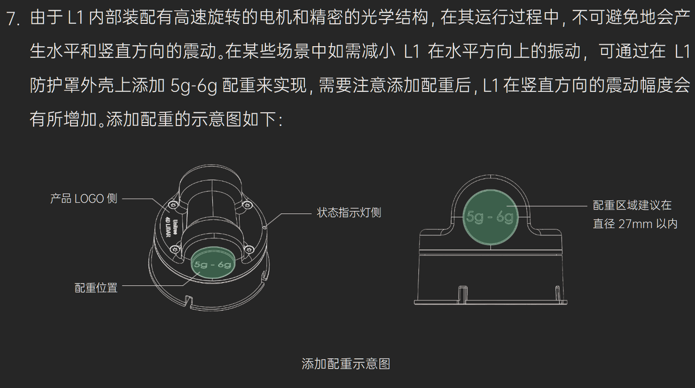

笑嘻了（

解决方案也可见视频：[简单一招 大幅缓解 宇树 L1 雷达 动平衡问题*哔哩哔哩*bilibili](https://www.bilibili.com/video/BV1PwRmYJEDM/?spm_id_from=333.337.search-card.all.click)：拧一个大概30mm长的M3铜柱。个人猜测和宇树GO2内部的抽象铜条一样是早期设计开模后已投产，更换成本高导致失误设计保留。

**宇树 L2**：大概40线，目前全新1799元，性价比高，二手价格虚高没有购买必要。无法拿到MID3602599教育优惠售价的可以考虑购买，就是有时候会缺货。

串口模式配置踩坑可见：[Unitree 4D LIDAR L2 串口模式教程\_unitree 4d lidar 测距开发-CSDN博客](https://blog.csdn.net/m0_63023420/article/details/148799455)我在使用Ubuntu22.04 ROS2 humble 时出现过很多抽象情况，在20.04 ROS1下稳定运行。我认为目前在大多数3D雷达开源算法均使用ROS1的情况下如果想少点折腾还是用ROS1把（

官方Point-LIO开源：[unitreerobotics/point\_lio\_unilidar: Point-LIO algorithm for Unitree LiDAR products.](https://github.com/unitreerobotics/point_lio_unilidar)但个人尝试感觉飘得厉害，可用性较低，可能是算法本身问题也可能是雷达素质问题。另外我使用时会出现一种很抽象的情况：开机后扫描出的点云是圆柱状的，但只要在启动的前几秒减缓雷达旋转，再启动官方提供的Point-LIO，再过几秒再停止减缓雷达旋转就能正常运行，原因暂时不明。

部署Fast-LIO可参考[jetson orin nano+ubuntu22.04+ros2+宇树L2激光雷达+fastlio2实现px4定点模式\_micro-xrce-dds-agent与px4-CSDN博客](https://blog.csdn.net/m0_67254825/article/details/148825941)

##### 4.1.2 MID360

目前的真神，比赛3D雷达的首选。行业应用与科研相当广泛，大量的人形机器人、四足、无人机、割草机、无人配送车都使用了这一款雷达，例如宇树G1、云深处绝影X30等。

Wiki：[1.2. Mid-360 — Livox wiki 0.1 文档](https://livox-wiki-cn.readthedocs.io/zh-cn/latest/tutorials/new_product/mid360/mid360.html)

雷达拆解可见：[(31 封私信 / 3 条消息) 雪岭 · 大疆览沃Mid-360激光雷达深度拆解报告 - 知乎](https://zhuanlan.zhihu.com/p/19902082988)

IP配置脚本：[ros-install-one-click/config\_static\_ip.sh at main · Auromix/ros-install-one-click](https://github.com/Auromix/ros-install-one-click/blob/main/config_static_ip.sh)

MID360为360°混合固态激光雷达，重量仅 265g，水平视场角 360°，最优测距范围 0.1\~20m，最远可达 70m，近处盲区仅 10cm，内部集成了3轴加速度计和3轴陀螺仪，本体IMU相当可用。教育优惠后仅2599元。在马术比赛中使用FastLIO+move\_base即可解决大部分场景，故工程实现可见：[使用mid360从0开始搭建实物机器人入门级导航系统，基于Fast\_Lio,Move\_Base-CSDN博客](https://blog.csdn.net/weixin_52612260/article/details/134124028)亲测此博客教程可稳定复现，上手看这一篇就行。

##### 4.1.3 速腾Airy

官方资料：[资源中心 - RoboSense速腾聚创 | 让世界更安全，让生活更智能](https://www.robosense.cn/resources-161)在列出的的几款雷达中纸面性能最佳，而且是纯固态雷达。性能对比可见：[(35 封私信 / 6 条消息) 机器人360°激光雷达——『速腾Airy』品鉴活动 - 知乎](https://zhuanlan.zhihu.com/p/28872599948)但是在技术支持与教程上远不如MID360，还存在发热严重等坑点。个人不推荐。

##### 4.1.4 禾赛JT16

禾赛2025年进军迷你激光雷达的入门级产品，基本上就是为了抢占MID360市场.全新3599，二手2500左右。重量比MID360更轻，直径比MID360更小，同时是目前视野最广的迷你 3D 激光雷达，解决了MID360顶部死角的问题。代价是资料确实少。[Developer Docs – Hesai Technology](https://hesaitechnology.github.io/dev/zh/)，除了官方资料外基本没有可参考的。

#### 4.2 建图与导航算法

建图算法：FastLIO，pointlio&#x20;

导航：AMCL+move\_base ego\_planning

##### 4.2.1 FastLIO

FAST-LIO是香港大学MARS实验室提出的激光-imu里程计方法。

核心特点为

* 采用快速迭代卡尔曼滤波器，优化里程计精度；

* 支持多数稳定环境下自动初始化；

* 通过并行 KD-Tree 搜索，降低计算量。

FastLIO2.0新增特性：

（1）采用ikd-Tree实现增量建图，速度更快，且支持激光雷达数据率超过 100Hz；

（2）基于原始激光雷达点云实现直接里程计，可禁用特征提取，精度更高；

（3）无需依赖特征提取，因此 FAST-LIO2 可支持多种类型的激光雷达，包括旋转式激光雷达和固态激光雷达，且易于扩展以支持更多型号；

（4）支持外接惯性测量单元（IMU）；

（5）支持基于 ARM 架构的平台。

源码：[hku-mars/FAST\_LIO: A computationally efficient and robust LiDAR-inertial odometry (LIO) package](https://github.com/hku-mars/FAST_LIO)

1.0论文及论文解读：

[2010.08196\] FAST-LIO: A Fast, Robust LiDAR-inertial Odometry Package by Tightly-Coupled Iterated Kalman Filter](https://arxiv.org/abs/2010.08196)

[(27 封私信 / 21 条消息) FAST-LIO论文解读与详细公式推导 - 知乎](https://zhuanlan.zhihu.com/p/587500859)

2.0论文及论文解读

[2107.06829\] FAST-LIO2: Fast Direct LiDAR-inertial Odometry](https://arxiv.org/abs/2107.06829)

[FAST-LIO2源码学习\_fastlio2源码解读-CSDN博客](https://blog.csdn.net/CCChester/article/details/124589627)

原始的FastLIO不具有回环功能的。也可以参考运由ETH RSL实验室修改的版本，其实现回环检测因此可以更加利于室内狭窄区域内的自主机动。

[yanliang-wang/FAST\_LIO\_LC: The tight integration of FAST-LIO with Radius-Search-based loop closure module.](https://github.com/yanliang-wang/FAST_LIO_LC)

##### 4.2.2 PointLIO

论文下载：<https://github.com/hku-mars/Point-LIO/files/10989136/Point-LIO_preprint.pdf>

源码：[hku-mars/Point-LIO](https://github.com/hku-mars/Point-LIO)

PointLIO算法是给极端高机动场景设计的，核心优势是逐点更新机制与抗IMU饱和能力。这里的”极端高机动“大约为13m/s到20m/s，和目前马术的1.5m/s到4m/s差距挺大的。目前四足最大的问题反而是底层控制的响应速度，但在测试中PointLIO在漂移上的表现还是好于FastLIO的。

（1）核心技术特性

PointLIO不将LiDAR点云积累成帧或关键帧，而是对每个LiDAR点单独处理：每个点到达时，直接与地图匹配并更新系统状态。其次，传统LIO/SLAM将IMU数据视为输入直接用于预测位姿，而Point-LIO将IMU测量值视为模型输出，通过随机过程建模IMU误差。即使IMU因高角速度饱和，仍能通过LiDAR点云修正位姿，避免系统崩溃。

（2）Point-LIO与主流SLAM算法的分类型对比

1. 与传统基于滤波器的激光SLAM对比

2. 与基于图优化的激光SLAM对比

##### 4.2.3 AMCL+move\_base

AMCL（Adaptive Monte Carlo Localization）与move\_base是最经典、最成熟的定位+路径规划组合。其中，AMCL负责机器人在地图坐标系下的位姿估计，move\_base负责路径规划与运动控制，二者通过ROS话题通信形成闭环，可以满足低速轮式机器人（八自由度足式机器人同理）的自主导航需求，上赛季狗子的竞速赛自动测试就是用这个方案。这东西资料实在是太多了就不赘述了。

快速入门最合适的看阿杰的视频：

[move\_base，年轻人的第一次导航*哔哩哔哩*bilibili](https://www.bilibili.com/video/BV1Fj421975o?spm_id_from=333.788.videopod.sections\&vd_source=193a56b6f00b33090010ba20d05cfef7)

[ROS导航系统 | 全局规划器*哔哩哔哩*bilibili](https://www.bilibili.com/video/BV1cx42127S8?spm_id_from=333.788.videopod.sections\&vd_source=193a56b6f00b33090010ba20d05cfef7)

[ROS导航系统 | AMCL 定位算法*哔哩哔哩*bilibili](https://www.bilibili.com/video/BV1rt421t76q?spm_id_from=333.788.videopod.sections\&vd_source=193a56b6f00b33090010ba20d05cfef7)

##### 4.2.4 Ego-Planner

[四足机器人测试ego planner*哔哩哔哩*bilibili](https://www.bilibili.com/video/BV1HM4y1h7fY/?spm_id_from=333.337.search-card.all.click\&vd_source=193a56b6f00b33090010ba20d05cfef7)

狗王测试过的方案。但毕竟原生是给无人机的算法所以要修改的地方还是挺多的，个人也没有在足式上部署测试过，没办法提供什么参考。

### 5 留形科技Odin1

这东西是在太过于逆天了。所以我再此为其单开一栏
