## （一）供电方案

### 1 电池选型

#### 1.1 TB47S、TB48S 

大疆 TB47S 和 TB48S 为曾经大疆植保无人机的核心动力组件。TB47S 采用 6S LiPo 构型，容量 4500mAh，电压 22.2V，能量密度达 99.9Wh，重量 595g；TB48S 则升级至 5700mAh 容量与 22.8V 电压，能量提升至 129.96Wh，重量增至 680g。这两款电池均支持实时电压监测、压差控制以及缓启动。TB48S电池的放电持续25A，140A峰值，短路电流可达200A±10A，在如今的马术比赛还算够用。目前大疆已经停产此款电池，闲鱼价格在50至400元，100以下收到50健康度以上的都算赚。使用手册详见石总的帖子：[【分享帖】RM-大疆智能电池使用手册-RoboMaster 社区](https://bbs.robomaster.com/article/9289?source=4)

官网充电器在100元左右。有神奇的开源充电架[【RM2023-RM电池充电架机械开源】-RoboMaster 社区](https://bbs.robomaster.com/article/9331)

TB48S的电池架也已经停产，电池架铜片需要发加工，目前也有1688的可购买非标：

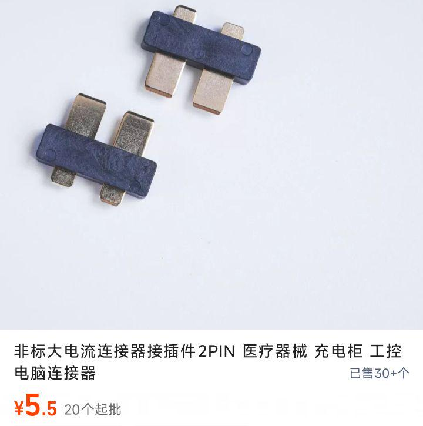

关于电池架设计可参考Robomaster开源论坛。[【分享贴】低成本通用电池架开源-RoboMaster 社区](https://bbs.robomaster.com/article/354231) [【分享帖】完全自制电池架结构开源-RoboMaster 社区](https://bbs.robomaster.com/article/9680)

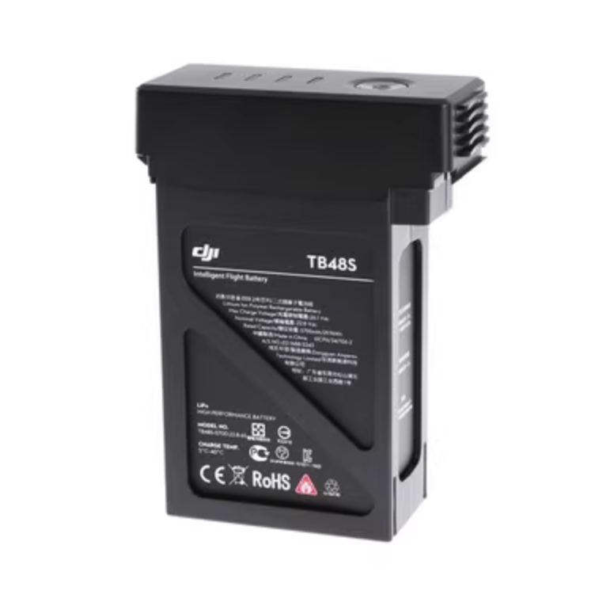

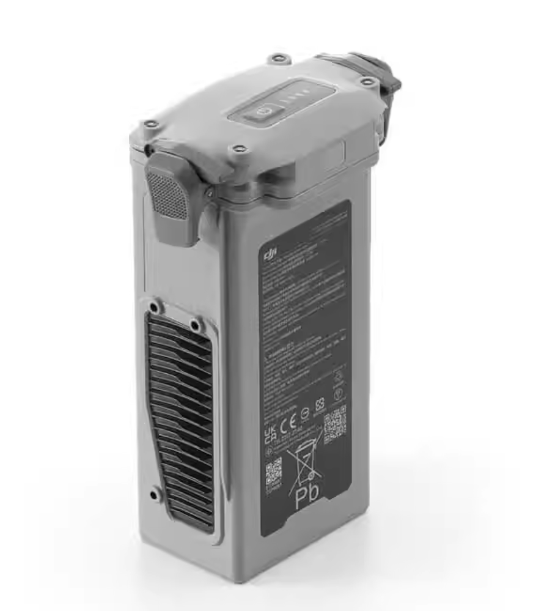

RM的新电池Matrice 4D电池的短路电流仅为85A±10A，与TB48SMOS管的安全工作区间不一致，其电池电池管理系统会设置较低的冲击电流保护门限，若反复超出MOS的安全工作区间会损坏MOS，进而出现电池关机后仍有输出等异常现象。马术比赛关节电机的反电动势基本靠电池硬吃，故此电池并不适合RC马术比赛[DJI Matrice 4D电池说明书及应用在RM比赛中的注意事项-RoboMaster 社区](https://bbs.robomaster.com/article/713040?source=4)

#### 1.2 软包航模电池

大功率软包航模电池以格瑞普等品牌为代表，凭借高倍率放电特性成为目前RC足式机器人比赛的首选动力方案。这类电池通常采用3S-6S构型，常见规格5200mAh容量，配合 30-60C持续放电能力，瞬时放电甚至可达100C以上。软包设计带来显著的重量优势，同等容量下比硬壳电池轻 10%-15%，如格瑞普 35C 磷酸铁锂软包电池能量密度超过 260Wh/kg，且通过叠片工艺降低内阻，在 45C 持续放电时仍能保持 93% 以上的效率。其循环寿命普遍在 150-300 次。形状定制灵活，不过物理防护较弱，建议制作电池仓保护。需严格控制充放电截止电压单节不低于 3.0V，适合短期高负载。

格瑞普算是航模电池里的苹果，好是好但是死贵，基本不虚标。富力、花牌也算很不错了。**放电电流（A）=（电池标称容量（mAh÷1000）×放电C数**，按照这个计算就行，害怕就按所有电机的峰值电流算。像疾风电池、狮牌之类的三线甚至杂牌电池默认虚标\*0.6，快速放电会猛猛掉电压，优势在于便宜量大管饱。

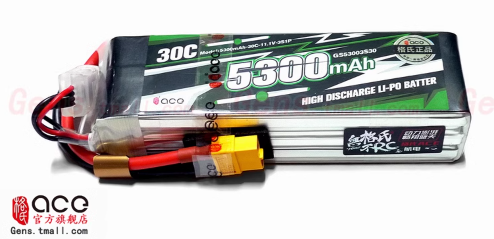

#### 1.3 大功率18650/21700

比较经典的例子有新安能jp30、亿纬50PL系列。此类电池依托全极耳技术重构了高倍率与长寿命的平衡，成为了比传统软包航模电池能量密度更高、放电更稳定、体积更小的选择。jp30持续放电60A，峰值放电140A，6S大约100元左右；亿纬50pl持续放电125A，峰值放电180A,6S大约120元左右。这类电池支持灵活的串并联组合，例如6S可以使用3+3、1 \* 6、2 \* 3等排列，但需自行设计焊接与散热方案，适合对定制化需求较高的领域，其1000-1500次的循环寿命大幅降低长期使用成本。应该会在之后逐渐替代软包航模电池。目前淘宝、闲鱼也有接定制的商家。

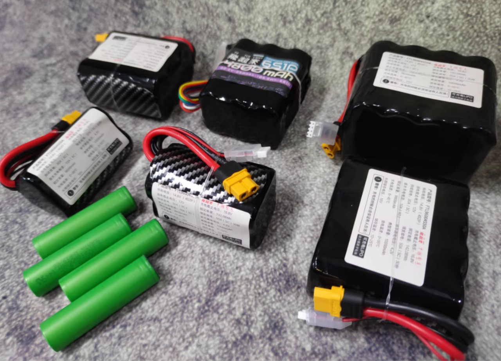

重量可参考以下图表。

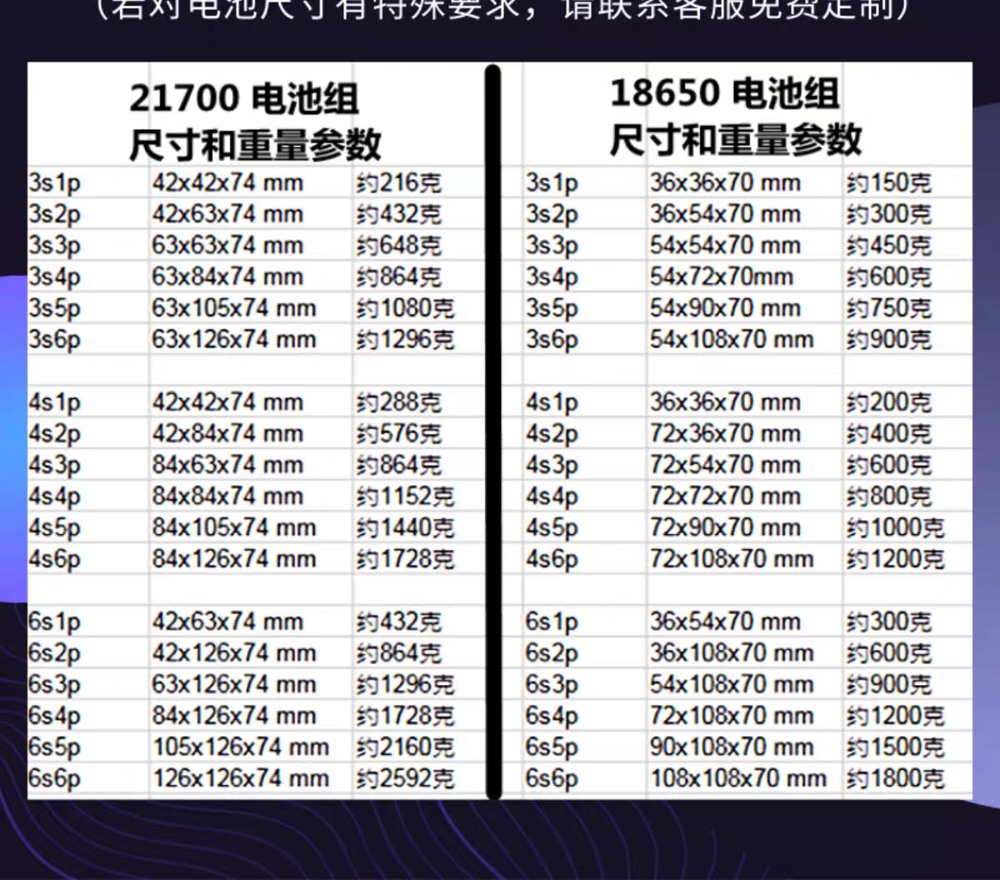

#### 1.4 宇树GO1电池

宇树 GO1 电池有6000mAh/133.2Wh与9000mAh/199.8Wh两个版本，3C 倍率下 1.5 小时即可充满。电池可实现24A持续、120A峰值。目前是有第三方的电池转接方案，测试下能充能取。之后看看能不能也成为马术电池的选择之一。

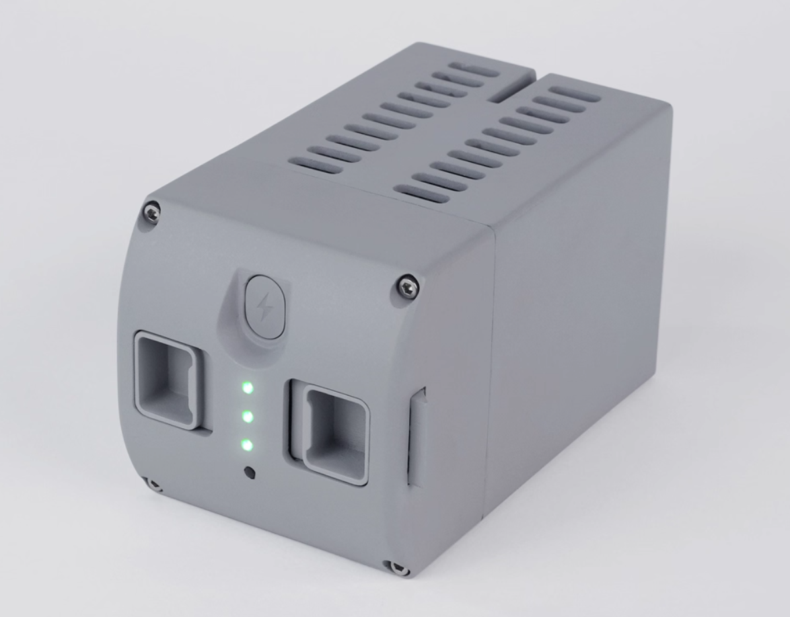

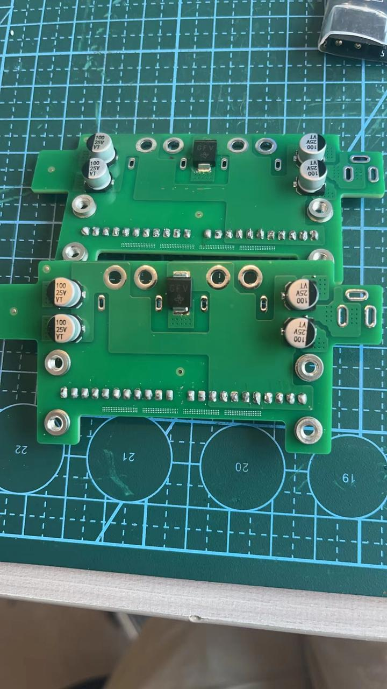

### 2 电路保护设计

#### 2.1 TB47S、TB48S 

TB47S和TB48S是大疆工业级无人机电池，采用全集成式保护方案。内置专用保护板通过硬件电路与软件算法的协同，实现过充、过流、过放保护，同时具备短路保护、温度保护及电芯电压均衡功能。配合电池管理系统（BMS）实时监测电芯状态，动态调整充放电参数。高度集成的设计使其无需外置保护电路即可直接使用，使用起来更为方便可靠。

#### 2.2 大功率软包航模电池 

大功率软包航模电池自身几乎不具备保护功能，且软包结构抗物理损伤能力较弱，因此通常需要额外配置外置保护措施。

保险丝是常用的过流与短路保护装置，作为电池与负载之间的熔断屏障。航模电池常进行高倍率放电，正常工况下电流已较大。一旦出现电调故障、电机堵转、接线错误或导线短路等异常情况，电流会迅速飙升至远超设备承受范围。此时，保险丝因过载产生的热量迅速熔断，切断供电回路，避免烧毁电调、电机等关键部件，同时防止电池因持续过流导致电芯发热、鼓包，甚至发生热失控和起火。

空气开关也是一种有效的保护手段。其内部的双金属片在电路过载时受热变形触发跳闸，快速断开电路，能在电机堵转、电调故障或接线错误引发的瞬时大电流下切断电源，防止电池和电调损坏或热失控。与保险丝不同，空气开关跳闸后可手动复位，避免频繁更换部件，提升调试便利性。此外，部分型号的空气开关支持根据电机功率和电调参数预设跳闸电流阈值，更好地匹配不同倍率电池的放电需求。其灭弧结构能有效抑制切断大电流时产生的电弧，减少触点烧蚀。需要注意的是，紧急停止开关仍需单独配置以确保安全。另外，请记得购买**单路**的**直流**空气开关。

#### 2.3 大功率18650/21700电池 

大功率18650/21700电池的保护体系与大功率软包航模电池相同，不再赘述。

#### 2.4 宇树GO1电池

宇树GO1电池内置的保护机制涵盖过压、过流、过热、短路、过放和欠压防护，结合IP67级防水防尘壳体和弹性锁紧结构，确保供电的稳定性。当单节电芯的压差超过设定阈值时电池会自动启动均衡充电。宇树GO1无需额外的外置保护装置即可直接满足使用需求。在DJI TB48S停产且Matrice 4D电池无法满足使用要求的情况下，宇树GO1有望成为新的选择。

## （二）关于驱动器

### 1 如何挑选适合的足式关节驱动器

众所周知，电机的转子输出力通常通过太阳轮、行星齿轮组和齿圈组成行星传动单元，这是大多数机器人关节传动的标准方案。扭矩通过法兰盘输出。在高扭矩和冲击载荷的工况下，电机本体及内部零件常受到径向力和轴向力的冲击。因此，在条件允许的情况下，输出单元应采用薄壁交叉滚子轴承，以便将外部冲击力有效传递给滚子轴承，保护内部零件免受损害。（例如4310P、8009P）

如果没办法去一一购买电机进行测试，那我们其实也可用进行简易的选型：优先关注转速、扭矩、相电流与重量，以及最核心的额定扭矩与峰值扭矩。转速基本够用即可，即在额定状态下（狗的正常工作扭矩一般为3-5N，当然这是需要计算的）对照电机T-N曲线大约为100RPM左右就行。

二级减速电机可以使用吗？答案是可以的，但这里需要引出一个概念：准直驱。

2016年,MIT的Wensing等提出了准直驱执行器(PA,ProprioceptiveActuator)的概念，并将其应用于四足机器人Cheetah和双足机器人Hermes。准直驱执行器是不依赖力/力矩传感器，仅依靠电流环开环力控，就可以感知机器人和外界的交互力的一种执行器。准直驱执行器由高扭矩密度电机和低传动比减速器组成，传动比通常在**10：1**以下。使用高扭矩密度的电机的目的是为了在使用低传动比减速器的情况下，尽可能保证执行器质量小而输出扭矩大。

主要优势是结构简单、成本低、透明度高、惯性小、带宽高。

* 结构简单、成本低。通过绕组电流解算电机扭矩，无需加装传感器。

* 高透明度，反驱性能好，缓解冲击的能力强。准直驱执行器不存在大减速比谐波减速器静摩擦力大，反驱困难，并且反驱时电流和输出力矩的关系难以进行数学建模的问题。

* 惯性小。低传动比减速器带来低惯性。低惯性能提高透明度和控制带宽。低惯性还意味着低阻抗。这有利于减少人形机器人运动的阻力。

* 带宽高。准直驱执行器也存在一些缺点：这种执行器在运行时会产生大量焦耳热，原因是减速器传动比小，电机输出扭矩大、速度低。扭矩大则所需的电流也大，而大电流会产生大量焦耳热。

另外，关于编码器。目前有大量的关节电机使用绝对值式编码器，并且其安装在永磁体转子上，即测量电机端的绝对位置。采用这样的单编码器方案极大地降低了整体驱动关节的实现成本。单编码器方案也会带来一定的缺陷，诸如在使用过程中，机器人在每次开机校准寻找关节输出零点时，必须保持特定的姿态，且初始位置需要远离零点，否则会出现跳变。所以在这里强烈推荐使用有双编码的电机。

除了准直驱执行器之外还有其他选择吗？我们这里简单列一个表展示。

*资料来源：《国内外双足人形机器人驱动器研究综述》、《面向柔顺关节的变刚度执行器设计与性能研究》，招商证券*

但大多数队伍是没办法考虑SEA等执行器的，因为价格实在太过于昂贵了。目前的主流成品关节电机也是使用PA为主。

这里有几篇文章可以可看看：

[(12 封私信 / 6 条消息) MIT Mini Cheetah的关节驱动器为何选用减速比为6的单级内嵌式行星减速器？ - 知乎](https://zhuanlan.zhihu.com/p/90921325)

[(14 封私信 / 21 条消息) MIT四足机器人关节驱动算法解析 | 编码器偏移与偏心率的校正 - 知乎](https://zhuanlan.zhihu.com/p/360556724)

[(14 封私信 / 21 条消息) MIT Mini Cheetah 的驱动与结构原理解读以及对尺寸效应的思考 - 知乎](https://zhuanlan.zhihu.com/p/58077049)

[(14 封私信 / 21 条消息) 对于腿足式机器人三类主流关节驱动器性能的对比讨论 - 知乎](https://zhuanlan.zhihu.com/p/32267807)

我们怎么知道电机需要多大的额定扭矩呢?最简单的方法是使用静力学分析。

让我们设想一只串联狗的侧视图。

它所受的外力就是地球对狗子的吸引力、地面对狗子的支撑力。取一条腿为例，假设受到地面的反作用了F，如果到第一个关节（hip）的力臂是L1，对它施加扭矩t1。到第二个关节（knee）的力臂是L2，对它施加扭矩t1。因为大部分时候足端正好处在肩部正下方，故第一个关节（hip）的力臂很短，电机几乎不用出什么力。第二个关节（knee）的力臂较长，电机要向外输出较大的力才能抵抗住地面反作用力作用在这个关节处上的扭矩，所以最核心的电机选型主要得围绕这个knee电机。按照简单的力矩力臂原理，以trot步态支撑（即双足支撑）整个身体的重量来计算，就可以计算出大致的电机负载，之后冗余个50%，就可以选电机了。

$$\tau_1 = F \times L_1$$

$$\tau_2 = F \times L_2$$

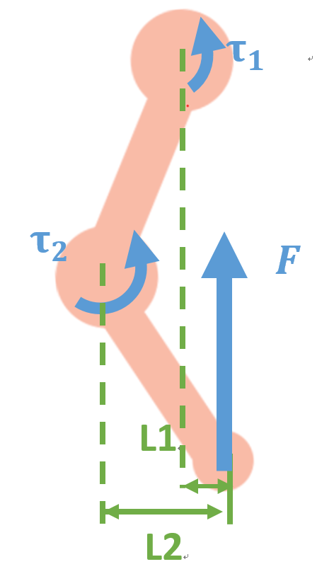

### 2 成品关节电机 

目前成品关节电机性价比较高的选择有：

* 灵足：RS01、RS02、RS03

* 宇树：GO-M8010-6

* 灯哥StackForce：6010、8018

* 大疆：3508

* 大然：PDA-04、PDA-08

* 达妙：4310V1.2/8006/8009/8009P

#### 2.1 成品关节电机参数对比表

由于各个电机厂商对额定扭矩与峰值扭矩的界定都不同，所以以上表格仅供参考。

电机的T-N曲线（电机的T-N曲线比电机的参数表更加参考性）

* 灵足RS01

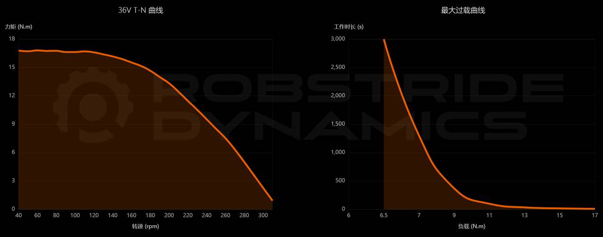

* 灵足RS02

  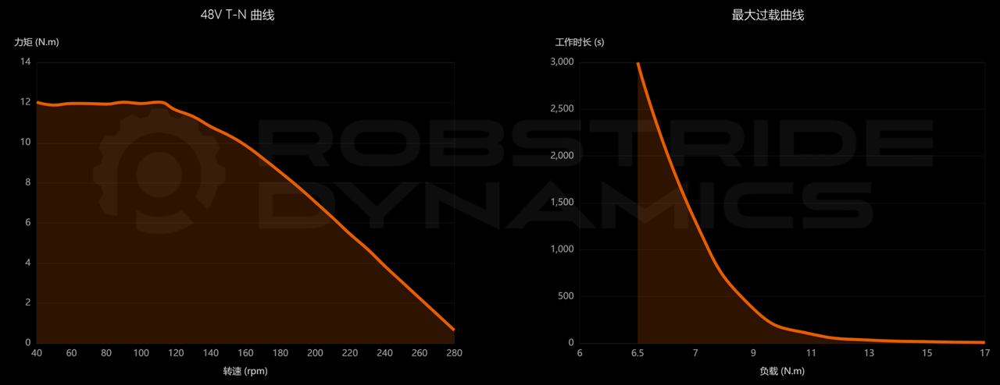

* 灵足RS03

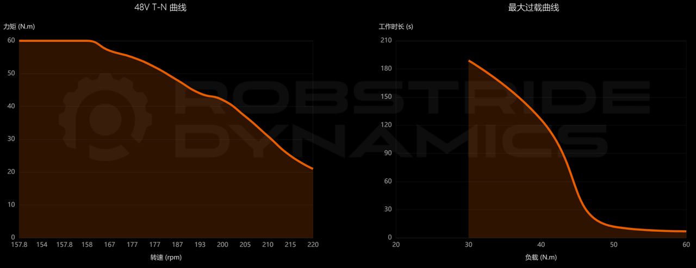

* 宇树GO-M8010-6（此处的RPM为转子速度而非输出轴，需要除以6.33）

  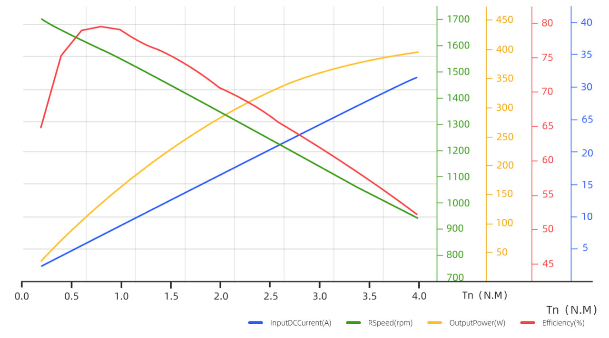

* 灯哥StackForce6010

暂未获取

* 灯哥StackForce8018

暂未获取

* 大疆3508

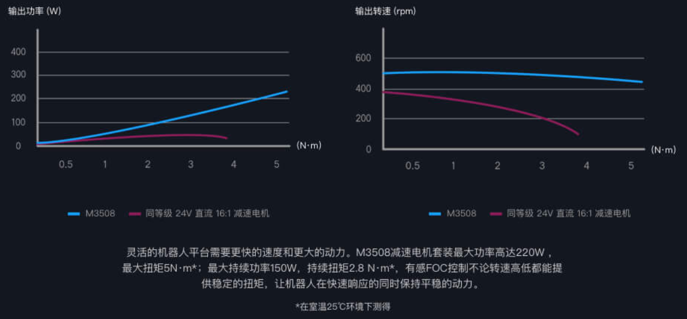

* 大然PDA-04

暂未获取

* 大然PDA-08

暂未获取

* 达妙4310/4310P

  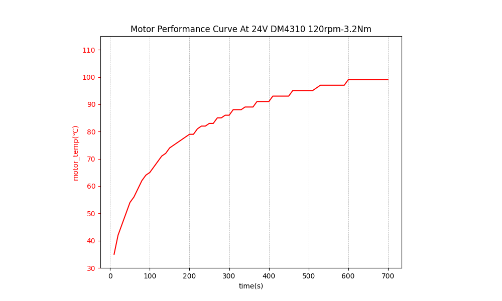

  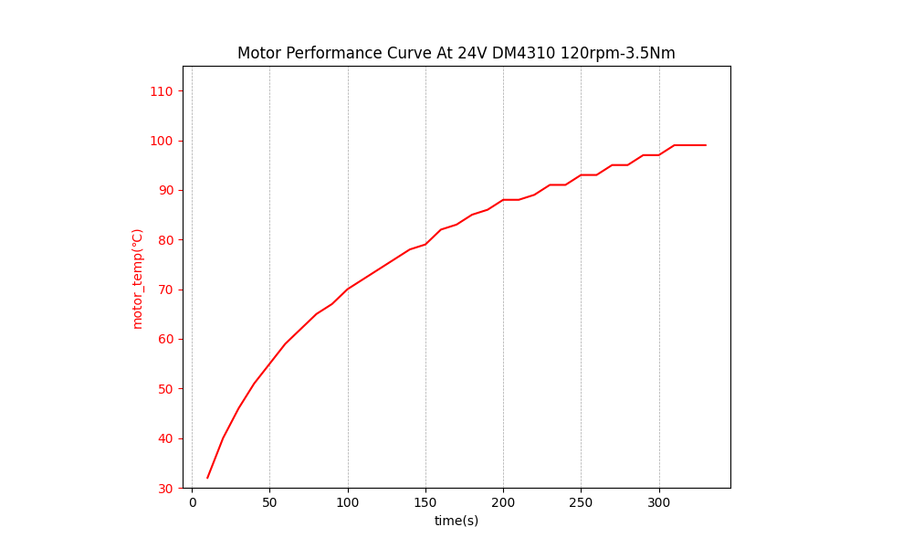

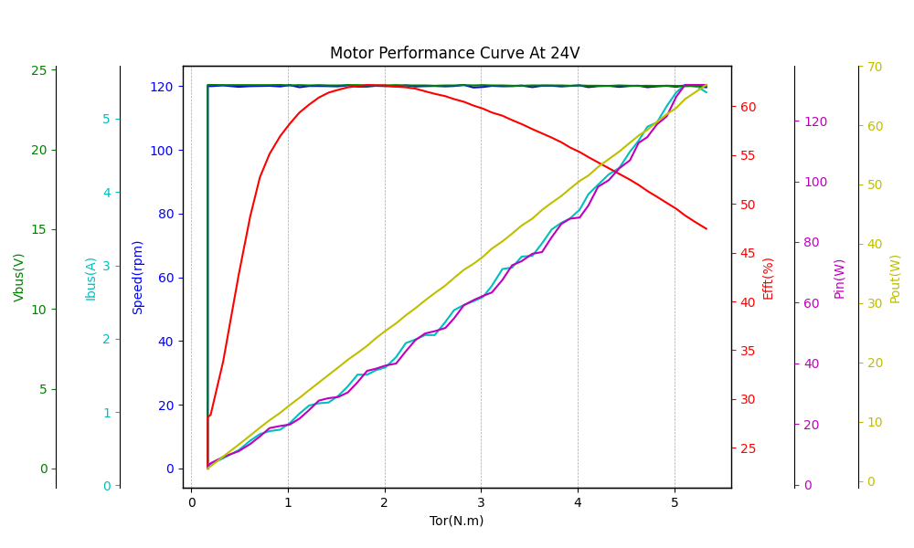

* 达妙8006 

* 达妙8009/8009P 

**对各家电机的个人主观评价：**

#### 2.2 灵足时代

灵足时代是福建理工大学MTI战队的冠名赞助商，为我们今年的Lainmal机器人提供了大量的RS00电机。在此感谢灵足电机的赞助。RS00电机不在本文的推荐范围中，是因为我们今年追求机器人的小型化和爆发性能做出了一定妥协，RS00的规格为4310，对机械设计并不算太友好，但正好适合用来修改tinymal使用。

灵足作为从小米独立出的公司，其通讯协议与小米cybergear电机相同，上手速度快。

灵足RS02是目前相对合适的四足关节电机，双编+较高的额定，全金属齿轮。不需要双编（机械设计上有设计初始位置快速标定的可以采用单编码器）可以选择RS01。RS03可以视为DM8009比较合适的平替，华南理工Robotic实验室四足、南京理工轮足就是使用这一款电机，反馈出色。这个价格与这个性能也没什么可挑剔的。

另外灵足时代存在一定问题。请务必关注电机的轴向受力。RS01/02是靠卡簧卡住的。这会导致轴向受力较弱，基本上把狗子单腿抓起来甩一甩就有风险了。

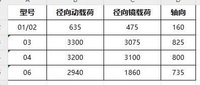

2026.01.21补充

灵足电机在特定零点位置附近，出现**编码器读数异常叠加 π 弧度**的故障，具体表现如下：

1. 即使通过上位机重新设置零点并重启设备，故障仍可稳定复现；

2. 电机在零点附近发生位置偏转后，编码器读数自动叠加 π 弧度（等效读数多转一圈）；

3. 该异常仅出现在电机 CAN 回传帧的编码器原始数据中，上位机下发的控制指令无此异常。

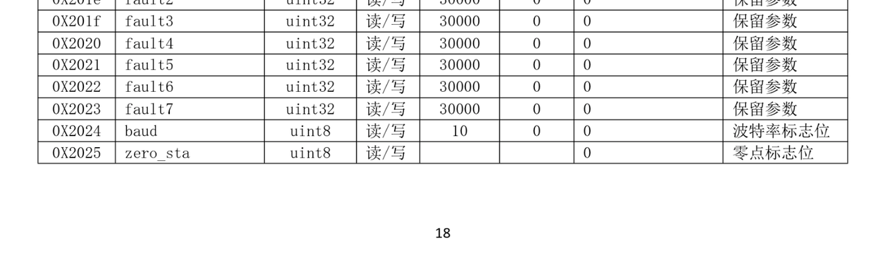

数据来源：[RS04使用说明书260112.pdf](https://github.com/RobStride/Product_Information/blob/main/%E4%BA%A7%E5%93%81%E8%B5%84%E6%96%99/RS04/RS04%E4%BD%BF%E7%94%A8%E8%AF%B4%E6%98%8E%E4%B9%A6260112.pdf)

故障核心原因为**电机零点标志位`zero_sta`的参数配置，与控制端的编码器角度范围定义不匹配**：

* `zero_sta`为编码器角度输出范围的标志位：参数值`0`对应角度范围`0-2π`，参数值`1`对应角度范围`-π-π`；

* 灵足电机出厂默认`zero_sta=0`，默认输出`0-2π`范围的角度值；

* 达妙电机控制体系默认适配`-π-π`的角度范围，二者角度定义不匹配，导致编码器零点判定逻辑异常，最终出现位置跳变、自动叠加 π 弧度的问题。

将电机的`zero_sta`零点标志位参数，从默认值`0`修改为`1`，使编码器角度输出范围适配为`-π-π`，与控制端的角度定义对齐，即可彻底解决该编码器读数异常跳变、叠加 π 弧度的故障。

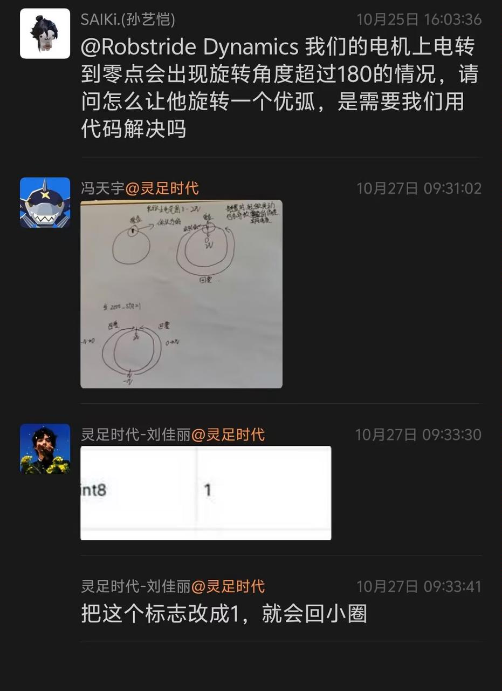

#### 2.3 宇树科技

宇树GO-M8010-6（后续统称GO1电机）是一款让我又爱又恨的电机。GO1电机使用的并不是在GO1机器人上使用的固件，属于零售，若想使用GO1机器人的拆机电机需要通过一些特殊手段零售版固件。GO1电机一直有流传缩水的说法，但在硬件上并没有什么缩水，主要是零售版在部分功能上存在缺失。内部为绝对值单编码器，减速器为尼龙齿轮而非金属齿轮——这一点及其逆天，我使用的GO1电机基本在3个月内都会出现一定的虚位，更有队伍在比较激进的调试下出现了齿轮断裂的问题。其次，宇树GO1电机的零售版本存在普遍反馈的上电自动进入工厂模式问题，怀疑是电压峰值超过了30V导致电机进入保护。处理方法为查询ID检查驱动板死活，查不到ID一般就直接发售后了。能查到ID就反复开启自动引导测试，一般3次内可以救回来。

关于宇树螺丝：GO1电机转子固定螺丝为M4 \* 14，内收GO定子固定螺丝为M3.5 \* 8，外凸GP定子固定螺丝为M3.5 \* 6，暂未找到把被破坏的GO螺纹孔扩紧的方法。3.5mm的螺丝更是逆天中的逆天，我不知宇树的结构工程师为什么要选型3.5mm的螺丝（摊手）。根据加工图数据，转子固定孔位深度为M4 \* 6，对角间距34.5mm。内收定子固定孔位深度为5.7mm。外凸定子固定孔位深度为4.5mm，对角间距85mm。

当然，宇树电机现在依然受到大量队伍的青睐。其一是因为其仅仅490元的学生售价，其次是因为宇树GO1电机极其可怕的爆发。以及宇树为485通讯，可以使用TTL转高速485（4M以上）通讯，甚至可以在位置控制下一个串口拖十二个电机，对控制器的资源占用相当少，不像其他电机动不动3到4个can口，个人认为在代码实现难度上是比canfd好写的。

山东科技老哥的激进测试，整机重量12.5kg

#### 2.4 灯哥Stackforce

不推荐使用。但如果经费不够可以上6010凑合——毕竟都329给你了还要什么自行车。这不是一款完善的工业产品，个人建议将其视为DIY的产品，不要对其易用性以及性能有太大期望，其背板甚至是使用3D打印的。根据使用队伍的反馈其力反馈数据存在问题，不清楚是代码原因还是电机原因。其主控为ESP32，算法为dengfoc。比较有趣的一点是，329的价格甚至比去江西伺泰威电机厂购买电机壳子还便宜，不过比不上去闲鱼买淘汰品就是了。也就是说可以把它视为买电机壳子送驱动板，买来自己拆板子换驱动器作为自制电机使用。

#### 2.5 DJI

作为每个Robocon/Robomaster队伍都有的电机，3508在25赛季依然证明了它的含金量。西南科大的3508dog依然可以实现1分钟半的障碍赛速通。但是3508的输出轴是天然不适合作为关节电机的——顶丝固定的可靠性实在欠佳。新队伍没3508就不要考虑了，直接上关节吧。

#### 2.6 大然机器人

大然的电机库使用容易，资料丰富，软件支持好，做工优秀，除了价格小贵之外没有什么缺点。

2025/10/12更新 PA-04在升级后有两个版本，可以考虑。

#### 2.7 达妙科技

达妙科技发来贺电。

达妙的电机本体并不算是非常好（对比因克斯、CubeMars等厂商），但达妙一定是目前开源生态、产品资料、技术支持最好的电机。另外，达妙的产品基本全系反向虚标（尤其转速）。三款最合适马术的电机8006、8009、8009P在降价后叠加教育优惠，分别杀到了800和1000价位。非常推荐。4310、4340更适合机械臂而非足式，在此不做推荐。

2025/10/11更新，4310升级了V1.2，能用力。8006的升级版也即将推出。

### 3 舵机 

其实当你选择了舵机时，国二基本就无缘了。需要拿奖和学校混钱/学校实在不支持可以考虑舵机方案。

舵机分为PWM舵机、总线舵机，以及部分支持力控的舵机。支持力控的舵机价格往往极其昂贵，还不如买电机。

**记得选择180度的**

#### 3.1 PWM舵机

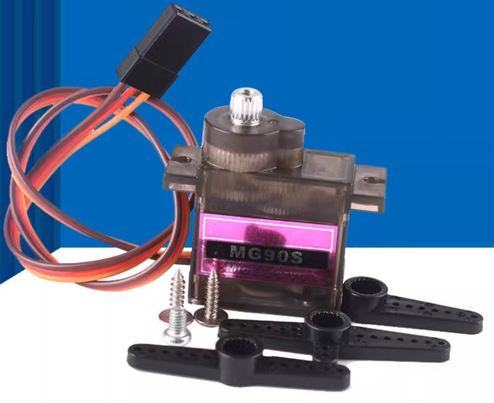

**MG90S：**分有全金属与半金属版本，全金属版本10R左右，半金属版本基本只在闲鱼有，在性能差不多的情况下将内部的部分齿轮更换为了尼龙齿轮降低成本，推荐后者。可以直接使用的项目有：

白泽六足：[Baize\_H1mini: Baize\_H1mini六足机器人是一个创客学习平台，通过该学习平台，可以学习mixly图形化编程，Arduino平台的C语言编程，ROS机器人编程，也可以学习一些传感器的控制。 在Baize\_H1mini中，我们摒弃传统的开发板+舵机驱动板的方式。开发板+舵机驱动板的方式一方面集成度不高，杜邦线接线麻烦且可靠性差；另一方面，集成板降低了电器元件的成本，让机器人制作更加方便。](https://gitee.com/li9535/baize_-h1mini)

灯哥菠萝狗：[GitHub - ToanTech/py-apple-structure: 灯哥开源的，可用于搭载 Py-Apple Controller 控制器和 Py-Apple Dynamics 四足控制软件的机械结构项目。目前包含有两种构型的机器狗（串联腿/并连腿），均可完美适配现有开源程序。机械结构经过长时间生产认证，结构稳定，安装简易。](https://github.com/ToanTech/py-apple-structure)

SG90、SG92R太容易烧了，不推荐。

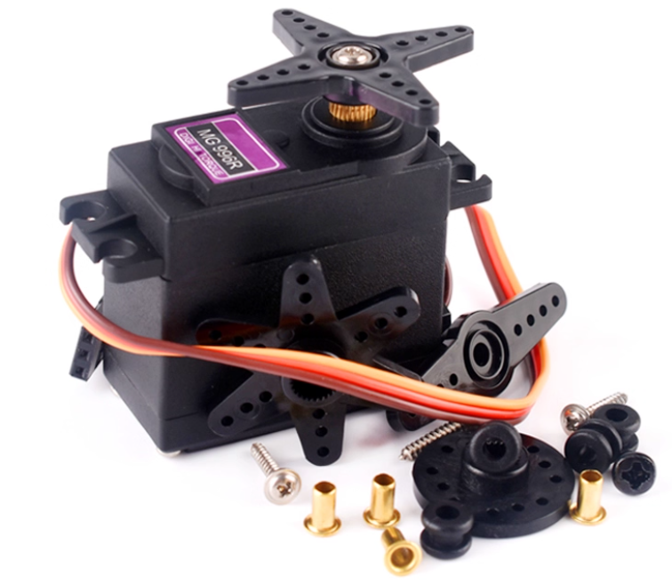

**MG995/MG996R：**非常经典的55g舵机，都这个价格了当兜底吧。也挺容易烧的。

**天空之星TD81系列：**性价比比较高的的全金属PWM舵机，不止这一款可以用就是。

#### 3.2 总线舵机

**优必选60kg总线：**

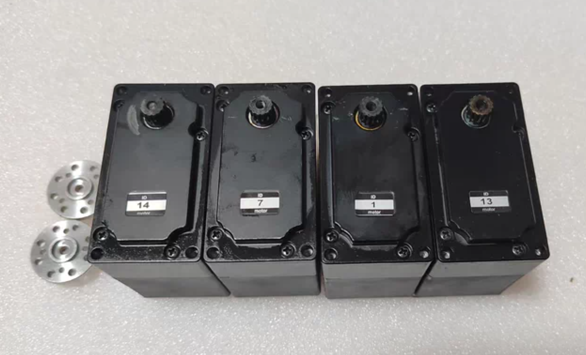

优点：支持18V-24V供电、CAN总线通讯、闲鱼只要80R、有自带控制板、有上位机（甚至支持图形化编程）、最多支持32个串联。目前这个价位应该是没有更合适的驱动器了。

以下协议图来自知乎作者[(14 封私信 / 26 条消息) XieMaster - 知乎](https://www.zhihu.com/people/nie-tie-75)

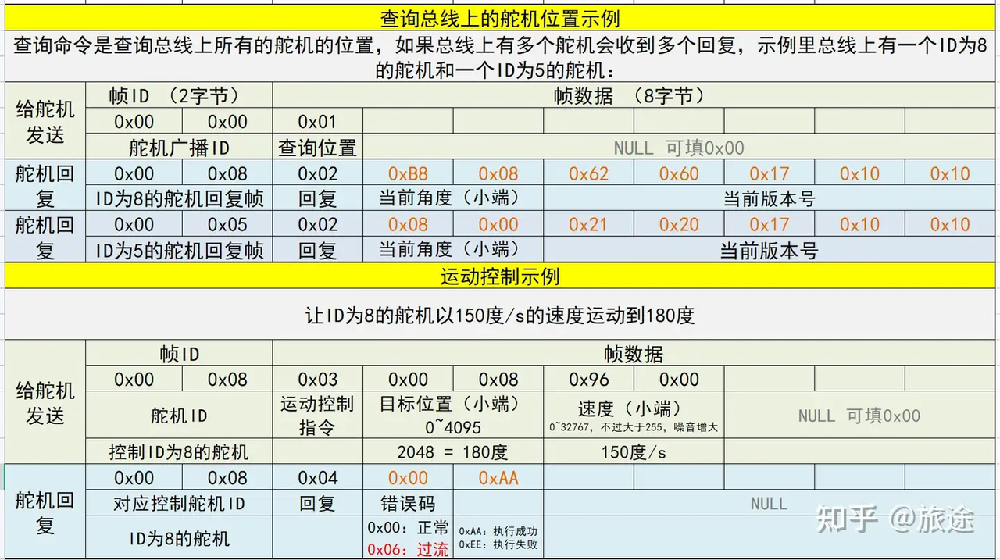

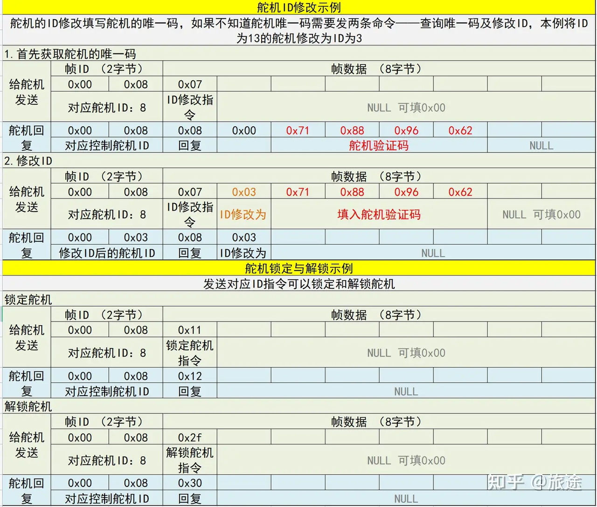

缺点：优必选已经倒闭了，没有如何官方技术支持、没有售后也不好开发票。

下图为配件。

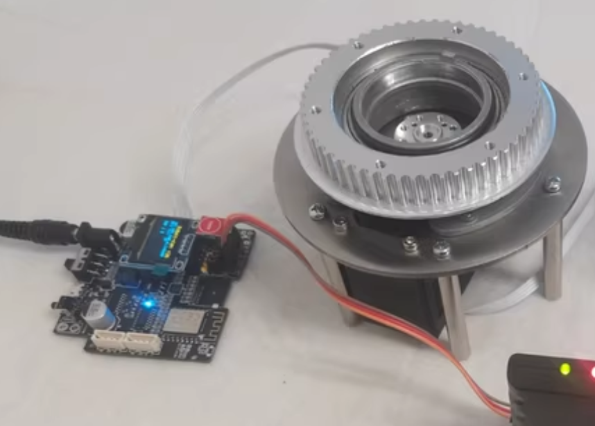

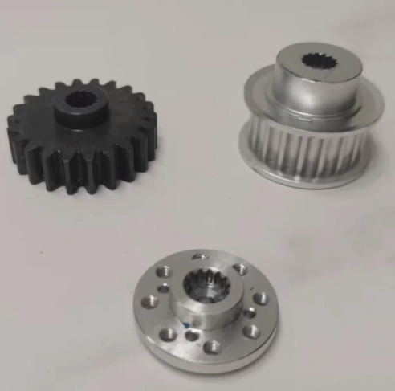

如果需要开票也可以选幻尔的总线舵机，当然价格上就没有那么美丽了。

### 4 自制驱动器

教程可以参考:[SimpleFOC、ODrive和VESC 教程链接汇总\_odrive和simplefoc哪个好-CSDN博客](https://blog.csdn.net/loop222/article/details/121201638)

SimpleFOC、ODrive和VESC是可以视为开源电机控制领域的三个代表性方案。下面简单介绍一下以便选型。

其实基本可选的就SimpleFOC、ODrive两个方案，可按照功率大小选择。VESC方案不适合关节电机。之前也只玩过成品的驱动器，不多妄加评价了。

## （三）通讯方案

### 1 关于CAN与485通讯

#### 1.1 CAN总线特点：

1.传统CAN2.0比较常用的为500Kbps，最大传输速率为1Mbps。仲裁比特率最高1Mbps，数据比特率最高8Mbps
2.多主结构，每个节点的地位平等，区域网络组建方便，总线的利用率也非常高。
3.出错的CAN节点会自动进行关闭并切断和总线的联系，不影响数据总线的通讯。
4.消息用于短帧结构和硬件CRC验证，干扰概率小，数据误差率很低。
5.自动检测消息是否发送成功，硬件可以自动重传，传输可靠性极高。
6.通信可以采用于普通双绞线、同轴电缆及光纤等。

#### 1.2 RS485特点:

1.RS-485电平与TTL电平可以兼容，可方便与TTL 电路系统连接。
2.RS-485的最大数据传输速率为**10 Mbps**。
3.rs-485具有多站能力，但在任何时候 rs-485总线上只能发送一个发射器。
4.rs-485接口具有良好的抗噪声性能、较长的传输距离和多站通信能力，是最佳的串行接口。
5.RS485接口一般为三根线，但一般只需要两根线即A、B，所以建议RS485接口采用屏蔽双绞线传输。

#### 1.3 CAN总线与RS485的比较（比赛场景内）

1.**总线的利用率**：RS485是单主从结构，即**总线只能有一个主机**，通信由主机发起，主机没有命令，下节点无法发送，并发送完即回，接收回复后，主机到下一个节点查询，以防止多个节点向总线发送数据，并导致数据混乱。而 CAN是一个**多主机结构**，每个节点都有 CAN 控制器，多个节点发送，发送 ID 号自动仲裁，这样可以防止总线数据混乱，而一个节点发送，另一个节点可以检测总线怠速，并立即发送，从而节省主机的查询，提高总线利用率，提高速度。。
2.**错误检测机制**：**rs485只提供物理层，而不提供数据链路层**，因此它无法识别错误，除非发生某些短路等物理错误。这很容易造成一个节点的破坏，疯狂向总线发送数据 ，这样会导致整个总线瘫痪。所以 rs485只要损坏一个节点，总线网络就会全部中断，这可能就是宇树疯狗的原因。但是**can总线有CAN控制器**，可以对总线进行检查任何错误，如果自身错误超过128，就会通过自动闭塞来保护总线。如果检测到另一个节点错误或其自身的错误，则向总线发送错误帧，以提醒其他节点数据是错误的。如此CAN总线就算一个节点跑飞，就会通过控制器自动锁定来保护总线。
3.**接口特性**：在RS-485网络中，当系统出现错误，出现多节点能够同时向总线发送相关数据时，导致服务总线呈现短路，从而造成损坏某些重要节点的现象。而且CAN节点在错误严重的情况下发展具有自动关闭输出管理功能，以使总线上其他节点的操作过程中不会受到波及，从而得到保证不会出异常在网络中，因个别节点之间出现这些问题，使得总线处于“死锁”状态。
4.**协议完善度**：CAN具有完善的通信协议，可由CAN控制器芯片及其接口芯片实现，大大降低了系统开发难度，缩短了开发周期，这是只有电气协议的RS485无法比的。 

所以，能用can还是用can吧。

#### 1.4 关于终端电阻

在我们查看宇树电机/3508电机等基于485/can总线通讯协议的电机技术手册时，常常看到一个词：终端电阻。这到底是什么？有什么用？

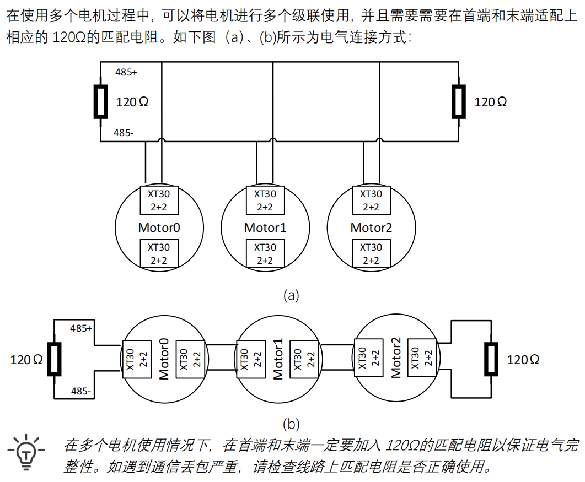

仿佛在通讯链路的首末两端加上这样一个法宝，即可避免信号的反射，使信号的传播更为顺畅。但终端电阻的作用是消除信号反射，但其实并不是所有情况都需要终端电阻，有时终端电阻反而会影响信号质量。

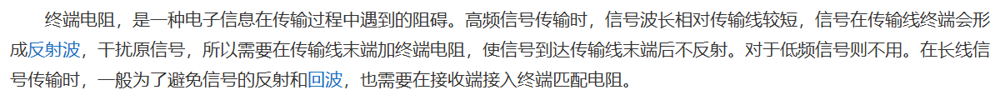

##### 1.4.1 CAN总线

CAN总线中，终端电阻是必不可少的。在显性状态期间，总线的寄生电容会被充电，而在恢复到隐性状态时，这些电容需要放电。如果CANH、CANL之间没有放置任何阻性负载，电容只能通过收发器内部的差分电阻放电。同时，信号在较高的转换速率情况下，信号边沿能量遇到阻抗不匹配时，会产生信号反射；传输横截面的几何结构发生变化，线缆的特征阻抗会随之变化，也会造成反射。在总线线缆的末端，阻抗急剧变化导致信号边沿能量反射，总线信号上会产生振铃，若振铃幅度过大，就会影响通信质量。在线缆末端增加一个与线缆特征阻抗一致的终端电阻，可以将这部分能量吸收，避免振铃的产生。

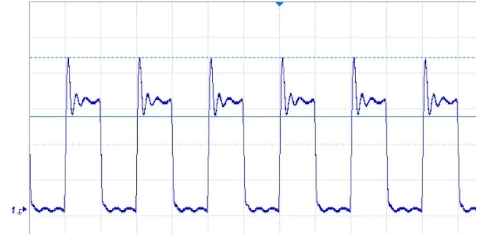

CAN总线无终端电阻

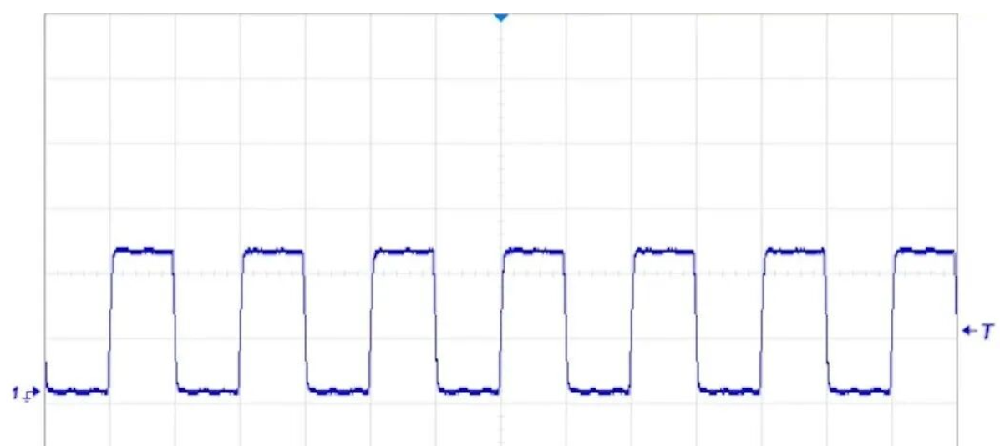

CAN总线增加终端电阻

##### 1.4.2 485总线

485总线设置终端电阻主要是为了用来抑制信号的反射。提高信号质量组建RS-485总线网络时，通常使用特性阻抗为120Ω的屏蔽双绞线，由于RS-485收发器输入阻抗一般较高，在信号传输到总线末端时会由于受到的瞬时阻抗发生突变，导致信号发生反射，影响信号的质量。

终端电阻虽然可以提高信号质量，但还具有以下几个问题：

* 降低了驱动信号的幅值

* RS-485总线上的负载越大，RS-485收发器输出差分电压幅值越低

* 增加终端电阻使通信线缆上的电流增大，产生了较大的压差，降低了接收端的信号幅值。RSM485ECHT在1200m,115.2kbps首端和末端的信号波形如下图所示（0.75mm2通信线），末端信号与首端信号相比下降了0.7V左右。

* 增加终端电阻对于接收状态时的工作电流影响不大，但会大大增加驱动状态时的工作电流。以RSM485ECHT为例，RSM485ECHT处于接收状态时工作电流为20mA左右，在驱动状态不加终端电阻时工作电流为27mA左右，在驱动状态加终端电阻时工作电流为83mA左右，可以看出终端电阻大大增加了RS-485收发器的功耗，对于有功耗要求的应用场合，应谨慎使用终端电阻。

我们可以简单概括：通信速度低或者通信距离近的情况下建议不加终端电阻。通信速度低或者通信距离近的情况下，信号反射对通信信号的影响不大，而且不加终端电阻可以大大降低功耗，并且通过加较大上下拉电阻值即可保证RS-485总线空闲时具有较高的差分电压幅值。通信距离较长且通信速度较快，对信号质量要求较高的情况，可以增加终端电阻，防止阻抗突变引起的信号反射问题，提高信号质量，但应确保在总线空闲时总线的差分电压不处于门限电平范围内。

##### 1.4.3 总结

对于CAN总线而言，为保证通讯的稳定性，必须增设终端电阻；RS-485总线不一样。终端电阻的设置需要根据情况而设置，在设计建议预留终端电阻位置，能有效解决总线干扰、通信异常等问题。

### 2 通讯方案设计

关节电机控制通讯方案的核心差异源于控制逻辑的集中程度，据此可划分为**全上位机控制方案**与**下位机控制方案**两大类。

#### 2.1 全上位机控制方案

全上位机控制方案的核心特征是采用具备引脚直出能力的MPU开发板或小主机作为控制核心，所有电机控制指令生成、数据处理均由上位机完成，通讯链路仅负责指令下发与状态回传。根据硬件形态差异，具体分为以下两类：

##### 2.1.1 MPU 开发板引脚直出方案

该方案直接利用 MPU 开发板的硬件接口扩展通讯能力，适用于对成本敏感且实时性要求中等的场景。

（1）CAN/CANFD 接口方案

部分开发板有自带can，例如OrangePi5。这种情况下将控制板上的CAN引脚引出即可。

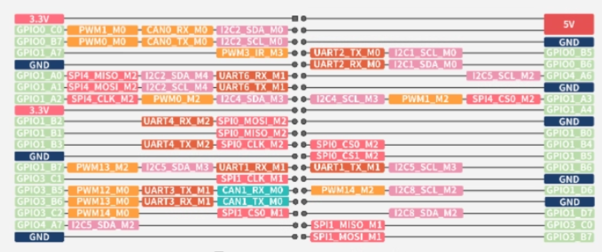

关于接口启动：[香橙派Orange Pi 5 Plus启用UART/I2C/SPI/PWM/CAN的方法\_香橙派 overlays-CSDN博客](https://blog.csdn.net/C___programmer/article/details/135604913)

（2）TTL 转 485 接口方案

华杰工控可能是目前最合适的ttl转485的选择。即插即用。

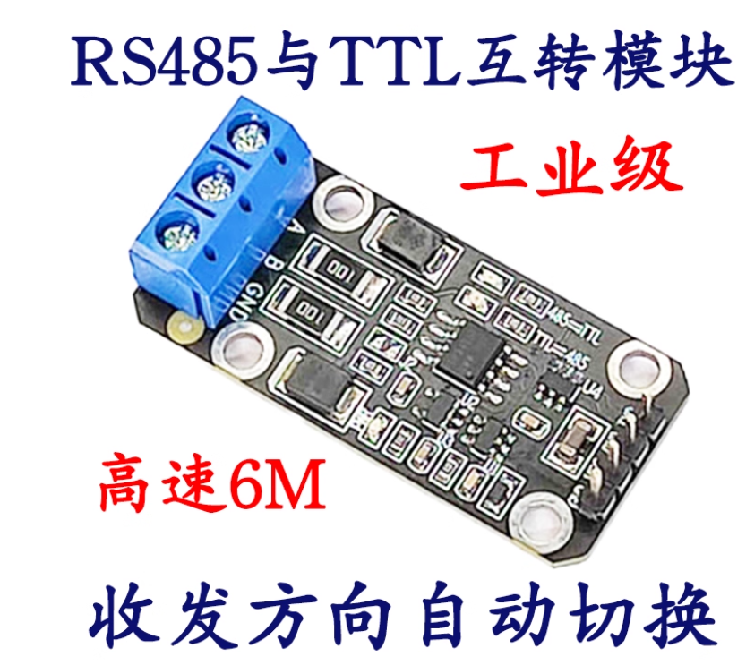

（3）SPI 扩展 CAN 接口方案

此方案最知名的就是MIT Cheetah的SPINE。此部分转接可以购买达妙的成品SPINE模块（虽然和官方的原版固件略有不同），但个人更推荐自制。喵魔改之后在部分成品狗的零件替换上是不可用的。

2025/10/12更新：喵似乎没卖了？

##### 2.1.2 NUC/小主机拓展方案

该方案利用 NUC 或小主机的高性能计算能力和丰富接口，适用于对实时性、扩展性要求极高的复杂系统。目前的主流机器人都是使用这类方案。主控上可以使用N100、RK3588、RK3566等。如果是考虑强化部署的话其实不用太忧虑性能，RK3588一个大核就够跑满了。

（1）USB/PCIE转通讯接口方案

以下是我用过的一些方案：

* 赤乌科技

做了板载的小主机供电集成、电机供电集成、USB转4路can和3路485，除了外观不怎么优雅之外没什么问题。另外一点是我个人其实挺排斥将大功率供电和信号接在一个板子上的，更何况还直连着主机供电。

评价为自带小米、灵足通讯例程的轮椅方案，可以考虑。

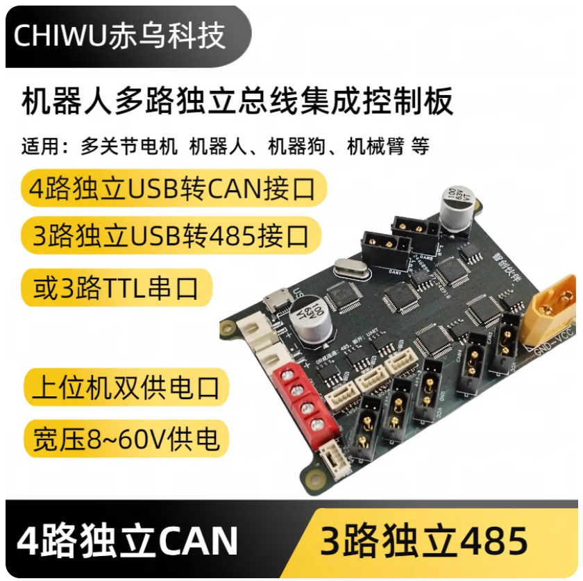

* 达妙USB转CAN/CANFD

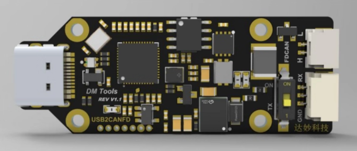

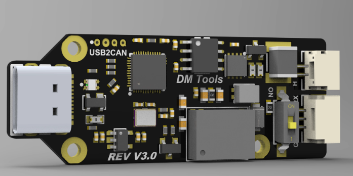

适合搭配达妙电机使用，极其方便。且使用CANFD版本也解决了之前十二自由度四足需要占用4个USB口的痛点（一般是添加一个USB2.0HUB解决）

2025/10/12更新：达妙新品 EtherCAT USB Ethernet 转4路CANFD 即将上线。

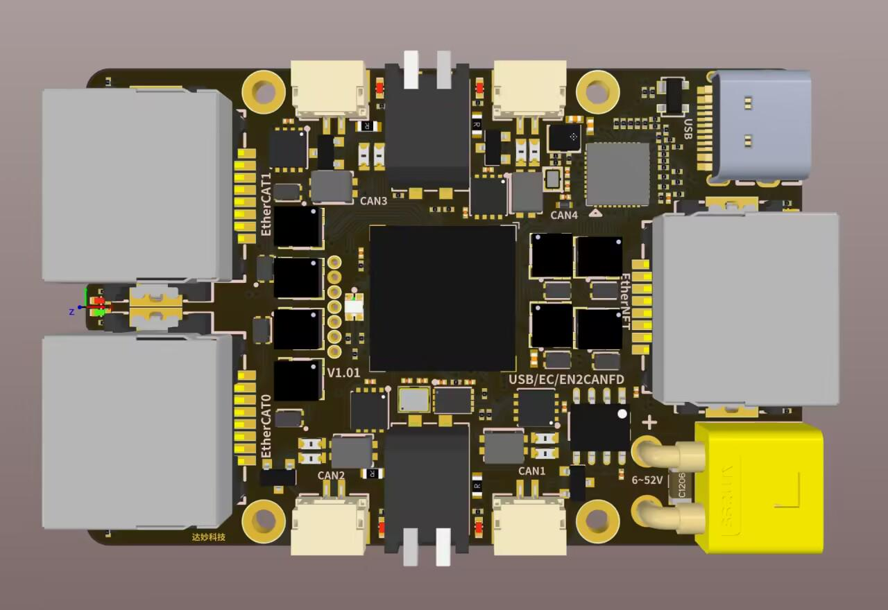

* 灵足/yourbee USB转CAN

与达妙同理，但不知道为什么达妙的USB转CAN无法驱动灵足电机（可能是我的程序问题），在此作为补充。

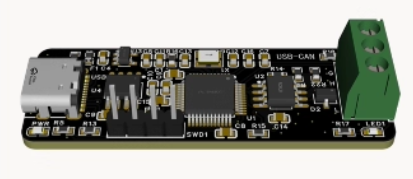

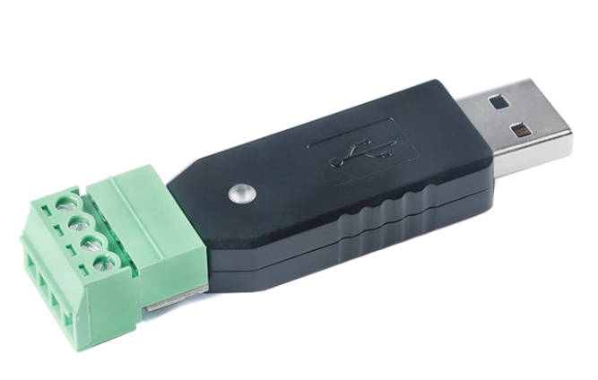

* DingLAB USB转两CAN/CANFD方案

提及这一款产品是因为有一套开源的电机通讯方案，基本覆盖了常用电机，

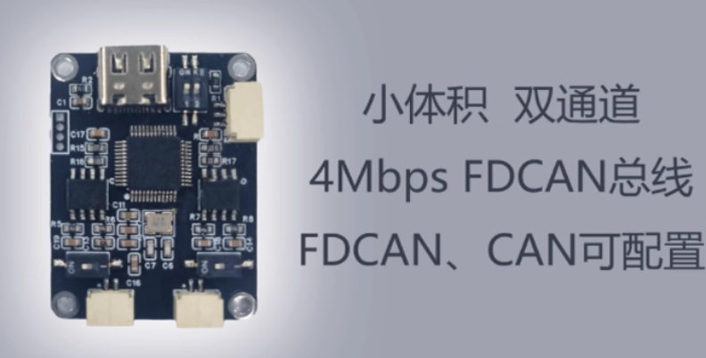

灵足：[SOULDE-Studio/USB2CAN-Demo-Lingzu: An project based on USB2CAN and RobStride motor.](https://github.com/SOULDE-Studio/USB2CAN-Demo-Lingzu)

达妙：[SOULDE-Studio/USB2CAN-Demo-DM: An project based on USB2CAN and DM motor](https://github.com/SOULDE-Studio/USB2CAN-Demo-DM)

CubeMars：[SOULDE-Studio/USB2CAN-Demo-CubeMars: An project based on USB2CAN and CubeMars motor](https://github.com/SOULDE-Studio/USB2CAN-Demo-CubeMars)

非常轮椅，强烈推荐。

（2）EtherCAT 方案

可能一部分读者对EtherCAT是没什么概念的，可以先看看这个视频。[EtherCAT玩起来*哔哩哔哩*bilibili](https://www.bilibili.com/video/BV1ejKqzZExN/?spm_id_from=333.337.search-card.all.click\&vd_source=193a56b6f00b33090010ba20d05cfef7)

文档：[EtherCAT (学习笔记)-CSDN博客](https://blog.csdn.net/pwl999/article/details/109397700)

EtherCAT最大的优势在于其极高的实时性，在工业控制中非常成熟，目前随着人形机器人的热潮，大量关节电机也开始有了加入了EtherCAT协议。

要完成一套通讯系统构建我们需要：支持EtherCAT协议的伺服驱动器、支持Linux的EtherCAT主站、实时内核补丁、ROS版本Noetic。

但有一点我挺好奇的，上位机一般为Linux主机，EtherCAT相比高速485、canfd的优势就在于其实时性，但极致优化的Linux才能做到高实时性，不用优化的RTOS就能做到ns级实时性。目前我似乎还是没发现在四足、人形上使用EtherCAT的优势。

#### 2.2 下位机控制方案

下位机通讯一般就使用开发板的can/ttl转485/开发板485直出即可。例如达妙H7开发板就有板载的485口，大部分在RC/RM生态内的开发板也基本有板载can口，基本就看你在MCU应用层的实现了。

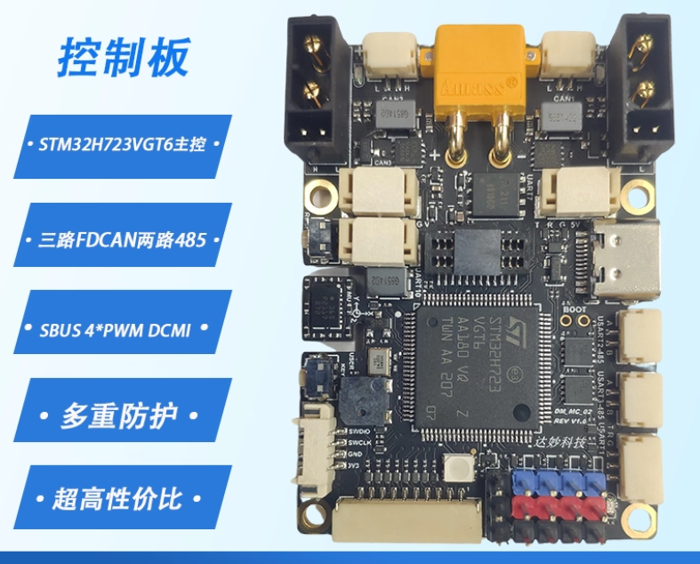

另外补充：位控、VMC使用大疆A板、大疆C板、达妙F446、达妙H7算力都是足够的，单纯位控甚至可以使用F1。当然VMC力控的控制频率越高效果越好，更推荐使用RK3566这种便宜的Linux小板。至于MPC这鬼东西就相当吃算力了，建议使用NUC，MIT方案的N4200基本是算力的底线了，MCU跑MPC太勉强。
